## Introduction

In `vignette("lm_design")`, the implicit assumption is that the optimal design is calculated before observing the data. In practice, experimentation may take place in multiple consecutive steps, in which case it is desirable to construct a new *augmented* optimal design $\boldsymbol{w}^*$ given an initial (approximate or exact) design $\boldsymbol{w}_0 = (w_1^{(0)}, \ldots, w_{n}^{(0)})$. Optimal design augmentation is supported by the `$augment()` method, which is demonstrated through several examples in this vignette.

In the context of design augmentation, the approximate optimal design problem from `vignette("lm_design")` can be updated to:
$$
\boldsymbol{w}^* \ = \ \arg \max_{\boldsymbol{w} \in \Delta^n} \Phi(M(\boldsymbol{w}\,|\, \boldsymbol{w}_0) + \lambda I) - \alpha \cdot \boldsymbol{c}'\boldsymbol{w}
$$
where the *conditional* information matrix $M(\boldsymbol{w}\,|\, \boldsymbol{w}_0) = M(\boldsymbol{w}\,|\, \boldsymbol{w}_0, \boldsymbol{X},\boldsymbol{v}, \gamma)$ is defined as a weighted linear combination of two individual information matrices cf. [@P06, Ch. 11]. For a linear model, the conditional information matrix takes the form:

$$
M(\boldsymbol{w}\,|\, \boldsymbol{w}_0) \ = \ (1 - \gamma) M(\boldsymbol{w}_0) + \gamma M(\boldsymbol{w}) \ = \ \frac{1}{\sigma_e^2} \sum_{i=1}^n \tilde{w}_i v_i \boldsymbol{x}_i \boldsymbol{x}_i',
$$
where $\tilde{w}_i = (1-\gamma) w_{i, 0} + \gamma w_i$. For an exact design, the weight contribution $\gamma$ is set to $\tfrac{m_1}{m_0 + m_1}$ in [@P06, Section 11.7], with $m_0$ the size of the initial design and $m_1$ the size of the new design. For an approximate design, $\gamma$ can be set to 0.5 equally weighting the old and new design, or $m_1$ can be set to the *intended* size of the new design. Since the weights $\boldsymbol{w}_0$ are known, the augmented design optimization problem can be solved using (almost) the same SOCP formulation as for the original problem in `vignette("lm_design")`. The only change is that weight lower bounds need to be added to ensure that the weights $w^*_i$ remain nonnegative:

$$
\tilde{w}_i \geq (1 - \gamma) w_{i, 0}, \quad \text{for } i = 1,\ldots,n
$$

From the weights $\tilde{\boldsymbol{w}}^*$ returned by the SOCP solver, the weights $\boldsymbol{w}^*$ that optimize the approximate design augmentation problem can be obtained as:

$$
w^*_i \ = \ \frac{1}{\gamma} \tilde{w}^*_i - \frac{1 - \gamma}{\gamma} w_{i, 0}, \quad \text{for } i = 1,\ldots, n
$$

No extra constraint is needed to guarantee that $\sum_{i=1}^n w_i = 1$, since:

$$
\sum_{i = 1}^n w_i \ = \ \frac{1}{\gamma} \sum_{i=1}^n \big[ (1-\gamma)w_{i, 0} + \gamma w_i \big] - \frac{1-\gamma}{\gamma} \sum_{i = 1}^n w_{i, 0} \ = \ 1,
$$

using that $\sum_i \tilde{w}_i = 1$ is a constraint in the SOCP and $\sum_i w_{i, 0} = 1$ by assumption.

### Bayesian perspective

A heuristic explanation for $M(\boldsymbol{w}\,|\,\boldsymbol{w}_0)$ being the sum of the information matrices of $\boldsymbol{w}_0$ and $\boldsymbol{w}$ is from the viewpoint of a Bayesian linear regression model. Let $\boldsymbol{X}$ be the $(m \times p)$ design matrix associated to an exact design $\boldsymbol{\xi}$ of size $m$, and assume a standard linear regression model:

$$
\boldsymbol{y}\ \sim \ \boldsymbol{X}\boldsymbol{\theta} + \boldsymbol{\epsilon}, \quad \boldsymbol{\epsilon} \sim N(\boldsymbol{0}, \sigma_e^2 I_m), 
$$

with the parameter vector $\boldsymbol{\theta}$ having a normal prior $N(\boldsymbol{\theta}_0, \boldsymbol{\Sigma}_0)$, encoding all prior knowledge after observing the initial design $\boldsymbol{\xi}_0$. The posterior covariance matrix of $\boldsymbol{\theta}|\boldsymbol{y}$, conditional on the error variance $\sigma_e^2$, has the following analytic form:

$$
\boldsymbol{\Sigma}\, |\, \sigma_e, \boldsymbol{\Sigma}_0 \ = \ \left( \boldsymbol{\Sigma}_0^{-1} + \frac{1}{\sigma_e^2} \boldsymbol{X}^T \boldsymbol{X} \right)^{-1},
$$

The conditional information matrix corresponds to the inverse of the posterior covariance matrix. Therefore, using that $M(\boldsymbol{\xi}) = \frac{1}{\sigma_e^2} \boldsymbol{X}^T \boldsymbol{X}$ and $M(\boldsymbol{\xi}_0) = \boldsymbol{\Sigma}_0^{-1}$, it follows that $M(\boldsymbol{\xi}\,|\,\boldsymbol{\xi}_0)$ is exactly the sum of the individual information matrices.

#### Active learning 

For the Bayesian linear regression model, a closed-form expression is available for the expected information gain $I(\boldsymbol{\xi}\,|\,\boldsymbol{\xi}_0)$, conditional on $\sigma_e$ and $\boldsymbol{\Sigma}_0$. Maximizing the expected information gain is a common information-theoretic query strategy in the context of *active learning* (@S09), which refers to online design augmentation based on a pre-defined utility function. The term active learning originates from the field of machine learning, where the modeler's objective is to select the most informative (unlabeled) data points for labeling from a candidate pool of unlabeled data to optimally enhance the training dataset of, for instance, a classification model. The expected information gain $I(\boldsymbol{\xi}\,|\,\boldsymbol{\xi}_0)$ is defined as the Kullback-Leibler divergence between the prior and posterior distributions, which for normal distributions simplifies to:

$$
\begin{aligned}
I(\boldsymbol{\xi}\,|\, \boldsymbol{\xi}_0) & \ = \ \frac{1}{2} \log(\det(\boldsymbol{\Sigma}_0)) + \frac{1}{2} \log(\det(\boldsymbol{\Sigma}^{-1}\,|\, \sigma_e, \boldsymbol{\Sigma}_0 )) \\
& \ = \ \frac{1}{2} \log(\det(\boldsymbol{\Sigma}_0)) + \frac{p}{2} \log(\det(M(\boldsymbol{\xi\,|\, \boldsymbol{\xi}_0}))^{1/p})
\end{aligned}
$$

The first term on the right-hand side is constant, the second term is identical to the (log) D-criterion of the conditional information matrix. Maximizing the expected information gain for a Bayesian linear regression model with a normal prior is therefore equivalent to calculating a D-optimal augmented design.

#### Bayesian Optimization

Going one step further, in the context of *penalized* D-optimal design augmentation with the aim to maximize an unknown response, define cost penalties $c_i = -\mu(\boldsymbol{x}_i)$, where $\mu(\boldsymbol{x_i})$ is the expected response at $\boldsymbol{x}_i$ given the current data or prior knowledge. The Lagrangian of the penalized D-optimal design objective with $\Phi(M) = \log(\det(M)^{1/p})$ can be formulated as:

$$
\mathcal{L}(\boldsymbol{w}, \nu, \boldsymbol{\tau}) = \frac{1}{p}\log(\det(M(\boldsymbol{w})) + \alpha \sum_{i} \mu(\boldsymbol{x}_i) w_i - \nu\Big(\sum_i w_i - 1 \Big) + \sum_i \tau_i w_i,
$$

using a multiplier $\nu$ for the equality constraint $\sum_i w_i = 1$, and multipliers $\tau_i \geq 0$ for the inequality constraints $w_i \geq 0$. Using [Jacobi's formula](https://en.wikipedia.org/wiki/Jacobi%27s_formula) and the cyclic property of the trace, the partial derivatives of the log-determinant with respect to the weights $w_i$ are:

$$
\begin{aligned}
\frac{\partial \log(\det(M(\boldsymbol{w}))}{\partial w_i} & \ = \ \text{Tr}\left[ M(\boldsymbol{w})^{-1} \frac{\partial M(\boldsymbol{w})}{\partial w_i} \right] \\
& \ = \ \text{Tr}\left[ M(\boldsymbol{w})^{-1} \left( \frac{1}{\sigma_e^2} \boldsymbol{x}_i \boldsymbol{x}_i^T \right) \right] \\
& \ = \ \frac{1}{\sigma_e^2} \boldsymbol{x}_i^T M(\boldsymbol{w})^{-1} \boldsymbol{x}_i,
\end{aligned}
$$

where the term $\tfrac{1}{\sigma_e^2} \boldsymbol{x}_i^T M(\boldsymbol{w})^{-1} \boldsymbol{x}_i$ is exactly the standardized prediction variance $\sigma^2(\boldsymbol{x}_i\,|\,\boldsymbol{w})$ at the point $\boldsymbol{x}_i$. At the optimal design $\boldsymbol{w}^*$, by the Karush-Kuhn-Tucker (KKT) stationary condition, it must hold that $\frac{\partial\mathcal{L}}{\partial w_i} = 0$ for each $i$. That is,

$$
\frac{\partial \mathcal{L}}{\partial w_i} \ = \ \frac{1}{p} \sigma^2(\boldsymbol{x}_i\,|\, \boldsymbol{w}^*) + \alpha \mu(\boldsymbol{x}_i) - \nu + \tau_i = 0, \quad \forall i
$$

Furthermore, by the (KKT) complementary slackness condition, $\tau_i w_i = 0$ for each $i$, which creates two possible scenarios:

$$
\begin{cases}
\frac{1}{p} \sigma^2(\boldsymbol{x}_i\,|\,\boldsymbol{w}^*) + \alpha \mu(\boldsymbol{x}_i) \ = \ \nu, & \text{if } w^*_i > 0,  \\
\frac{1}{p} \sigma^2(\boldsymbol{x}_i\,|\,\boldsymbol{w}^*) + \alpha \mu(\boldsymbol{x}_i) \ = \ \nu - \tau_i \leq \nu, & \text{if } w^*_i = 0.
\end{cases}
$$

These (*general equivalence theorem*) equations state that: at the optimal design $\boldsymbol{w}^*$, the balance between the posterior predictive variance and the expected mean response is the same everywhere across the support of the design. As a consequence, if a single design point is selected (i.e. $\boldsymbol{w}^*$ has a single support point), this is equivalent to maximization of the acquisition function:

$$
\text{acq}(\boldsymbol{x}_i) = \mu(\boldsymbol{x}_i) + \lambda \sigma^2(\boldsymbol{x_i} | \boldsymbol{w}^*)
$$

where we substituted $\lambda = \frac{1}{\alpha p}$. This acquisition function is similar in spirit to the *Upper Confidence Bound* (UCB) acquisition function in [Bayesian Optimization](https://en.wikipedia.org/wiki/Bayesian_optimization), except that the exploration term in the UCB acquisition function is the posterior predictive standard deviation $\sigma(\boldsymbol{x}_i)$ instead of the predictive variance of the surrogate model. Another minor difference is that the D-optimal exploration term $\sigma^2(\boldsymbol{x}_i | \boldsymbol{w}^*)$ includes the information of the augmented design point, whereas the UCB exploration term $\sigma(\boldsymbol{x}_i)$ is the predictive standard deviation before augmenting the design.

Similarly, it can be verified that for a linear model D-optimal design with heterogeneous weights $v_i = \mu(\boldsymbol{x}_i)^2$ (without cost penalties), when augmenting the design by a single design point, the optimal design maximizes the acquisition function:
$$
\text{acq}(\boldsymbol{x}_i) \ = \ \mu(\boldsymbol{x}_i)^2 \sigma^2(\boldsymbol{x_i} | \boldsymbol{w}^*)
$$
This acquisition function involves a multiplicative trade-off between exploitation and exploration terms, instead of the additive trade-off above. An advantage of the multiplicative trade-off is that the augmented design is invariant under scaling of $\boldsymbol{v}$. This is not the case for the first acquisition function, where the augmented design depends on the scaling parameter $\alpha$ and the scaling of the costs $\boldsymbol{c}$.

#### Gaussian process regression

Both active learning and Bayesian optimization typically use *Gaussian process regression* (GPR) as a surrogate model for the response of interest. The standard GPR model can be approximated by a Bayesian linear model [@RW06, Ch. 2] of the form:
$$
\boldsymbol{y} \ \sim \ \Phi(\boldsymbol{X}, \boldsymbol{Z}) \boldsymbol{\theta} + \boldsymbol{\epsilon}, \quad \boldsymbol{\epsilon} \sim N(\boldsymbol{0}, \sigma_e^2 I_m)
$$

with the vector $\boldsymbol{\theta} \sim N(\boldsymbol{0}, I_p)$ having a standard normal prior. The matrix $\Phi(\boldsymbol{X}, \boldsymbol{Z}) \in \mathbb{R}^{m \times p}$ is the projection of the feature matrix $\boldsymbol{X} \in \mathbb{R}^{m \times d}$ onto the span of a finite set of inducing points $\boldsymbol{Z} \in \mathbb{R}^{p \times d}$ using the Gaussian process kernel $k(\boldsymbol{x}, \boldsymbol{z})$. Specifically, $\Phi(\boldsymbol{X},\boldsymbol{Z})$ consists of row vectors $\phi(x)^T$, with:
$$
\phi_Z(\boldsymbol{x}) \ = \ K_{ZZ}^{-1/2} k(\boldsymbol{Z}, \boldsymbol{x})
$$

Here, $K_{ZZ}^{-1/2}$ is an inverse square root matrix of the kernel matrix $K_{ZZ} \in \mathbb{R}^{p \times p}$ with elements $K_{ij} = k(\boldsymbol{z}_i, \boldsymbol{z}_j)$; and $k(\boldsymbol{Z}, \boldsymbol{x}) \in \mathbb{R}^{p \times 1}$ is the cross-kernel vector between $\boldsymbol{Z}$ and $\boldsymbol{x}$ with elements $k_i = k(\boldsymbol{z}_i, \boldsymbol{x})$. If $\boldsymbol{Z} = \boldsymbol{X}$, $\Phi(\boldsymbol{X}, \boldsymbol{X})$ simplifies to a square root of the kernel matrix $K_{XX} \in \mathbb{R}^{m \times m}$ and the posterior mean of the Bayesian linear model coincides with that of the GPR model. However, the predictive variance at a new point $\boldsymbol{x}^*$ is $k(\boldsymbol{x}^*, \boldsymbol{X}) K_{XX}^{-1} k(\boldsymbol{X}, \boldsymbol{x}^*)$ which tends to zero when extrapolating away from the span of $\boldsymbol{X}$, whereas the GPR predictive variance tends to $k(\boldsymbol{x}^*, \boldsymbol{x}^*)$. Therefore, to exactly align the two models, draws from the GP posterior at $\boldsymbol{x}^*$ should be sampled as:
$$
f(\boldsymbol{x}^*) \ \sim \ \phi_X(\boldsymbol{x}^*)^T \boldsymbol{\theta} + \delta(\boldsymbol{x}^*), \quad \delta(\boldsymbol{x}^*) \sim N\left(0, k(\boldsymbol{x}^*, \boldsymbol{x}^*) - k(\boldsymbol{x}^*, \boldsymbol{X}) K_{XX}^{-1} k(\boldsymbol{X}, \boldsymbol{x}^*) \right).
$$

Suppose that $\boldsymbol{\xi}$ is the exact design producing the feature matrix $\boldsymbol{X} \in \mathbb{R}^{m \times d}$, then the information matrix $M(\boldsymbol{\xi})$ of the (approximate) Gaussian process regression model is given by:
$$
M(\boldsymbol{\xi}) \ = \ \frac{1}{\sigma_e^2} \Phi(\boldsymbol{X}, \boldsymbol{Z})^T \Phi(\boldsymbol{X}, \boldsymbol{Z}) + I_p
$$

This means that penalized design augmentation can be performed for GPR models in the same way as for linear models using the feature map $\Phi(\boldsymbol{X}, \boldsymbol{Z})$ as the linear model design matrix. An advantage of GPR design augmentation in a linear model context is that the augmented design can be optimized jointly over the candidate design grid, whereas multi-dimensional discrete optimization of the acquisition function in standard active learning and Bayesian optimization is normally avoided due to the exploding computational cost. 

Note that for regression models with noise, i.e. $\sigma_e^2 > 0$, a ridge penalty with $\lambda = \sigma_e^2$ should be added to the diagonal of the linear model information matrix to match the above formulation for $M(\boldsymbol{\xi})$.

## Examples

### Augmented extraction experiment

As an example of design augmentation for a linear model, we revisit the augmented extraction experiment from [@GJ11, Ch. 3]. In the experiment, the extraction yield of a specific lipopeptide from a microbial culture is measured subject to 6 culture parameters: presence of methanol solvent ($x_1$), presence of ethanol solvent ($x_2$), presence of propanol solvent ($x_3$) , presence of butanol solvent ($x_4$), culture pH ($x_5$), time in solution ($x_6$). All factor levels are encoded as $-1$ and $+1$ referring to the absence or presence of each solvent and a low or high level of the pH and time in solution respectively. Following [@GJ11], a linear model including all main effects terms and a subset of 6 first-order interaction terms is assumed to model the extraction yield:


``` r
library(cvxoptdes)

## 6 factors w/ 2 levels each
data <- expand.grid(
  x1 = c(-1, 1),
  x2 = c(-1, 1),
  x3 = c(-1, 1),
  x4 = c(-1, 1),
  x5 = c(-1, 1),
  x6 = c(-1, 1)
)

## linear model w/ main effects and selected interactions
design <- lm_design$new(
  formula = ~1 + x1 + x2 + x3 + x4 + x5 + x6 + x2:x3 + x1:x6 + x2:x6 + x3:x6 + x4:x6 + x1:x4,
  data = data
)
```

Given the linear model and the candidate design grid, an initial design of size $m_0 = 12$ with orthogonal main effects design columns, as well as a design augmentation of size $m_1 = 8$ is proposed in [@GJ11, Ch. 3]:


``` r
## reference designs 
init_design <- c(0, 0, 0, 0, 0, 0, 0, 1, 1, 0, 0, 0, 0, 0, 1, 0, 0, 1, 1, 0, 0, 0, 0, 0, 0, 0, 0, 0, 0, 1, 0, 0, 0, 0, 0, 1, 1, 0, 0, 0, 0, 1, 0, 0, 0, 0, 0, 0, 0, 0, 0, 0, 1, 0, 0, 0, 0, 0, 1, 0, 0, 0, 0, 1)

new_design <-  c(0, 1, 0, 0, 1, 0, 0, 1, 1, 0, 0, 1, 0, 0, 1, 0, 0, 1, 1, 0, 0, 0, 0, 0, 0, 0, 0, 0, 0, 1, 1, 0, 0, 0, 0, 1, 1, 0, 1, 0, 0, 1, 0, 0, 1, 0, 0, 0, 1, 0, 0, 0, 1, 1, 0, 0, 0, 0, 1, 0, 0, 0, 0, 1)

## initial design
data[init_design > 0, ]
#>    x1 x2 x3 x4 x5 x6
#> 8   1  1  1 -1 -1 -1
#> 9  -1 -1 -1  1 -1 -1
#> 15 -1  1  1  1 -1 -1
#> 18  1 -1 -1 -1  1 -1
#> 19 -1  1 -1 -1  1 -1
#> 30  1 -1  1  1  1 -1
#> 36  1  1 -1 -1 -1  1
#> 37 -1 -1  1 -1 -1  1
#> 42  1 -1 -1  1 -1  1
#> 53 -1 -1  1 -1  1  1
#> 59 -1  1 -1  1  1  1
#> 64  1  1  1  1  1  1

## new design points
data[new_design - init_design > 0, ]
#>    x1 x2 x3 x4 x5 x6
#> 2   1 -1 -1 -1 -1 -1
#> 5  -1 -1  1 -1 -1 -1
#> 12  1  1 -1  1 -1 -1
#> 31 -1  1  1  1  1 -1
#> 39 -1  1  1 -1 -1  1
#> 45 -1 -1  1  1 -1  1
#> 49 -1 -1 -1 -1  1  1
#> 54  1 -1  1 -1  1  1

## criterion value
design$crit(new_design, criterion = "D")
#> [1] 0.9466774
```

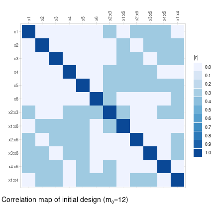

Using the `lm_design`-class, an approximate D-optimal augmented design can be calculated with the `$augment()` method with $\gamma = \tfrac{m_1}{m_0 + m_1} = 0.4$ and passing the initial design vector to the `design_weights` argument:


``` r
## approximate augmented design
design$augment(design_weights = init_design, gamma = 0.4, criterion = "D") |> round(2)
#>  [1] 0.03 0.00 0.00 0.03 0.10 0.03 0.00 0.00 0.00 0.03 0.00 0.10 0.00 0.00 0.00 0.00 0.00 0.00 0.00 0.00 0.01 0.00 0.04 0.00 0.00 0.00 0.04 0.01 0.04
#> [30] 0.00 0.00 0.04 0.00 0.00 0.04 0.00 0.00 0.00 0.07 0.00 0.00 0.00 0.00 0.00 0.07 0.04 0.03 0.00 0.07 0.05 0.00 0.00 0.00 0.07 0.00 0.04 0.04 0.00
#> [59] 0.00 0.00 0.00 0.00 0.00 0.00
#> attr(,"criterion")
#> attr(,"criterion")$crit.value
#> [1] 0.9738337
#> 
#> attr(,"criterion")$crit
#> [1] "D"
```

For the calculation of an exact D-optimal augmented design, the `$round()` method is used by passing the initial design vector to the `augment_design` argument. The `optimal` rounding method executes the same exchange algorithms as before, but excluding any of the design points in the initial design from being exchanged with new design points. The D-optimal augmented design is almost identical to the reference design from [@GJ11, Ch. 3], except for one design point, the reason being that the D-criterion can be marginally improved (0.14\%) by substituting the point $(+1, -1, -1, -1, -1, -1)$.


``` r
## exact augmented design
(augment_design <- design$round(m = 8, method = "optimal", seed = 1, augment_design = init_design))
#>  [1] 0 0 0 0 1 1 0 1 1 0 0 1 0 0 1 0 0 1 1 0 0 0 0 0 0 0 0 0 0 1 1 0 0 0 0 1 1 0 1 0 0 1 0 0 1 0 0 0 1 0 0 0 1 1 0 0 0 0 1 0 0 0 0 1
#> attr(,"criterion")
#> attr(,"criterion")$crit
#> [1] "D"
#> 
#> attr(,"criterion")$crit.value
#> [1] 0.9480523
#> 
#> attr(,"criterion")$crit.rel.eff
#> [1] 0.9735258

## proposed design points
data[augment_design - init_design > 0, ]
#>    x1 x2 x3 x4 x5 x6
#> 5  -1 -1  1 -1 -1 -1
#> 6   1 -1  1 -1 -1 -1
#> 12  1  1 -1  1 -1 -1
#> 31 -1  1  1  1  1 -1
#> 39 -1  1  1 -1 -1  1
#> 45 -1 -1  1  1 -1  1
#> 49 -1 -1 -1 -1  1  1
#> 54  1 -1  1 -1  1  1
```

A consequence of the D-optimal augmentation is that the main effects columns in the augmented design matrix are no longer uncorrelated. Instead, we can augment the design by imposing the orthogonality constraints that the main effects remain uncorrelated in the augmented design (at the cost of a lower D-criterion value). The exact design is obtained using the `"orthogonal"` rounding method, since `"optimal"` rounding does not take into account the orthogonality constraints in the `$orthogonal` field:


``` r
## clone design object + add constraints
design_ortho <- design$clone()
design_ortho$update(
  orthogonal = list(
    x1 + x2 + x3 + x4 + x5 + x6 ~ x1 + x2 + x3 + x4 + x5 + x6 ~ 0  ## uncorrelated main effects
  )
)

## approximate augmented design
design_ortho$augment(design_weights = init_design, gamma = 0.4, criterion = "D", return_value = FALSE)

## exact augmented design
(ortho_augment_design <- design_ortho$round(m = 8, method = "orthogonal", augment_design = init_design, highs_control = list(log_to_console = FALSE)))
#>  [1] 0 0 0 0 1 0 0 1 1 0 0 1 0 0 1 0 0 1 1 0 0 0 0 1 1 0 0 0 0 1 0 0 0 0 1 1 1 0 0 0 0 1 0 0 0 1 0 0 0 1 0 0 1 0 0 0 0 0 1 0 0 0 1 1
#> attr(,"criterion")
#> attr(,"criterion")$crit
#> [1] "D"
#> 
#> attr(,"criterion")$crit.value
#> [1] 0.869514
#> 
#> attr(,"criterion")$crit.rel.eff
#> [1] 0.9072305

## proposed design points
data[ortho_augment_design - init_design > 0, ]
#>    x1 x2 x3 x4 x5 x6
#> 5  -1 -1  1 -1 -1 -1
#> 12  1  1 -1  1 -1 -1
#> 24  1  1  1 -1  1 -1
#> 25 -1 -1 -1  1  1 -1
#> 35 -1  1 -1 -1 -1  1
#> 46  1 -1  1  1 -1  1
#> 50  1 -1 -1 -1  1  1
#> 63 -1  1  1  1  1  1
```

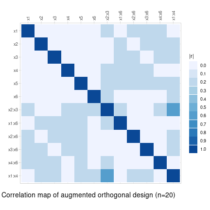

### Fullerenes dataset

As a second example, we load the `fullerenes` dataset, which reports the production of o-xylenyl adducts of Buckminster fullerenes. Three process conditions: temperature (in °C), reaction time (in minutes) and relative concentration of sultine to C60, are varied to maximize the mole fraction of the desired product:


``` r
fullerenes
#>     reaction_time sultine_conc temperature product_amount
#> 1               3          1.5         100      0.5247368
#> 2               3          1.5         110      0.7034221
#> 3               3          1.5         120      0.8494228
#> 4               3          1.5         130      0.9176888
#> 5               3          1.5         140      0.9190989
#> 6               3          1.5         150      0.9151403
#> 7               3          3.0         100      0.6792475
#> 8               3          3.0         110      0.8544264
#> 9               3          3.0         120      0.9298701
#> 10              3          3.0         130      0.9162607
....
```

<div class="figure">
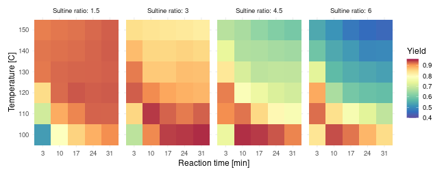
<p class="caption">Fullerenes dataset</p>
</div>

The objective is to find the conditions that maximize the product yield keeping the number of experiment runs low to save time and costs. To accomplish this, we adopt a sequential penalized D-optimal augmentation strategy by assigning costs relative to the predicted response function and repeatedly proposing one or more design points aiming to improve the accuracy of the predicted response (and cost) function. The process can be iterated until we run out of budget, or if a satisfactory optimum is reached. As explained in the *Bayesian Optimization* section, the cost penalties induce an acquisition function that is closely related to UCB acquisition, balancing between exploration of the design space through the design criterion and exploitation of the response function through the chosen cost penalties.  

#### Linear model sequential design

Assuming no prior knowledge of the target response surface, we base our sequential design approach on a full quadratic model including linear and quadratic terms for the main effects and first-order interactions between the temperature, reaction time, and sultine ratio conditions:


``` r
## full quadratic model
design <- lm_design$new(
  formula = ~(temperature + reaction_time + sultine_conc)^2 + I(temperature^2) + I(reaction_time^2) + I(sultine_conc^2),
  data = apply(fullerenes[, -4], 2, scale),  ## standardized data columns
  alpha = 0.01,                  ## cost scaling parameter
  lambda = 1e-4                  ## ridge penalty parameter
)

## initial I-optimal design
design$optimize(criterion = "I", return_value = FALSE)
init_design <- design$round(m = 5, method = "optimal", seed = 1)

## initial design points
fullerenes[init_design > 0, ]
#>     reaction_time sultine_conc temperature product_amount
#> 1               3          1.5         100      0.5247368
#> 5               3          1.5         140      0.9190989
#> 19              3          6.0         100      0.8364682
#> 97             31          1.5         100      0.9078710
#> 120            31          6.0         150      0.4478669
```

<div class="figure">
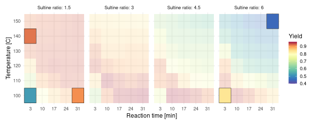
<p class="caption">D-optimal initial design (m₀=6)</p>
</div>

Starting from an I-optimal initial design of size $m_0 = 5$, we augment the design by 3 new design points a total of 5 times. In each iteration, heterogeneous cost penalties are assigned based on 1 minus the current predicted yield, thereby encouraging new design point proposals with a high expected yield. A small ridge penalty is added $\lambda = 1e-4$ to allow the generation of an initial I-optimal design with less observations than the number of model parameters ($p = 10$).

The first figure below displays the final design of size $m = 20$ after 5 design augmentations of size 3, with the number inside each tile referring to the iteration at which the design point was proposed (0 corresponding to the initial design). The second figure displays the predicted response surface given the data of the final design of size $m = 20$. In comparison to standard Bayesian optimization using a GPR surrogate model, the parametric linear model is less flexible in modeling the target response function (i.e. higher prediction bias). On the other hand, the linear model imposes more structure on the response function a priori (i.e. lower prediction variance) compared to a fully data-driven Gaussian process model, which may be preferable when the total number of observations is limited as in this example.


``` r
## initialize 
n_iter <- 5
new_design <- init_design
design_points <- which(init_design > 0)

for(i in 1:n_iter) {
  ## update response weights
  fit <- lm(update(design$formula, product_amount ~ .), data = fullerenes[new_design > 0, ])
  design$update(cost = 1 - predict(fit, newdata = fullerenes))
  ## augment design
  design$augment(design_weights = new_design, criterion = "I", return_value = FALSE)
  new_design1 <- design$round(m = 3, method = "optimal", seed = 1, replicates = FALSE, augment_design = new_design)
  ## track design point proposals
  design_points <- c(design_points, which(new_design1 - new_design > 0))
  new_design <- new_design1
}

## proposed design points
fullerenes[tail(design_points, 3 * n_iter), ]
#>     reaction_time sultine_conc temperature product_amount
#> 93             24          6.0         120      0.5839802
#> 111            31          4.5         120      0.7063200
#> 117            31          6.0         120      0.5778373
#> 18              3          4.5         150      0.6743638
#> 60             17          3.0         150      0.8345172
#> 115            31          6.0         100      0.8492748
#> 52             17          1.5         130      0.9266864
#> 61             17          4.5         100      0.9450543
#> 102            31          1.5         150      0.9291388
#> 46             10          6.0         130      0.5710976
#> 54             17          1.5         150      0.9205931
#> 106            31          3.0         130      0.8720959
#> 6               3          1.5         150      0.9151403
#> 9               3          3.0         120      0.9298701
#> 55             17          3.0         100      0.9430810
```

<div class="figure">
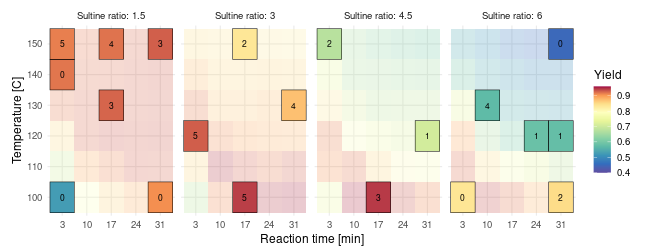
<p class="caption">Online D-optimal design augmentation (m=20)</p>
</div>

---

<div class="figure">
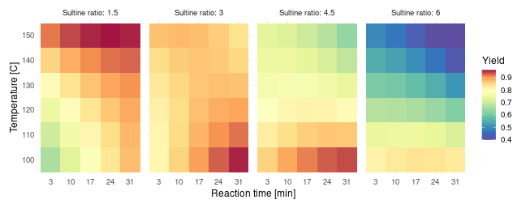
<p class="caption">Predicted yield based on augmented design (m=18)</p>
</div>

#### GAM sequential design

Alternative to a linear model of fixed complexity, we can also base our sequential design augmentation on a generalized additive model (GAM) with an increasing number of basis functions as more data becomes available. In this way, the GAM is able to adapt to the complexity of the response surface similar to a GPR surrogate model in the context of standard Bayesian Optimization.

Again assuming no prior knowledge of the target response surface, we start with the GAM formula `~ s(temperature, reaction_time, sultine_conc, k = 12)`, which is a general isotropic 3D (thin plate) spline smoother with $k = 12$ basis functions. The initial design is an I-optimal design of size $m_0 = 12$, and we augment the design by 2 new design points a total of 4 times. In each iteration, costs are updated using the predicted yield obtained by fitting a GAM with $k = m_i$ basis functions to the available data, where $m_i$ is the number of data observations at the $i$-th iteration.


``` r
library(mgcv)

## initial GAM w/ k=12 basis functions
design <- gam_design$new(
  formula = ~ s(reaction_time, temperature, sultine_conc, k = 12),
  data = apply(fullerenes[, -4], 2, scale),  ## standardized data columns
  alpha = 0.01                ## cost scaling parameter
)

## initial I-optimal design
design$optimize(criterion = "I", return_value = FALSE)
init_design <- design$round(m = 12, method = "optimal", seed = 1)
```

<div class="figure">
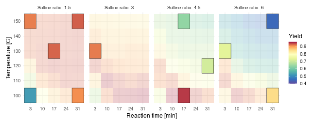
<p class="caption">I-optimal initial design (m₀=12)</p>
</div>


``` r
## initialize
n_iter <- 4
new_design <- init_design
design_points <- which(init_design > 0)
formula_template <- product_amount ~ s(reaction_time, temperature, sultine_conc, k = .)

for(i in 1:n_iter) {
  ## update gam formula and costs
  formula_iter <- formula_template
  formula_iter[[3]][[5]] <- length(design_points)  ## no. basis functions
  fit <- gam(formula_iter, data = fullerenes[design_points, ])
  design$update(
    formula = formula_iter[-2],
    cost = 1 - predict(fit, newdata = fullerenes, type = "response")
  )
  ## augment design
  design$augment(design_weights = new_design, criterion = "I", return_value = FALSE)
  new_design1 <- design$round(m = 2, method = "optimal", seed = 1, replicates = FALSE, augment_design = new_design)
  ## track design point proposals
  design_points <- c(design_points, which(new_design1 - new_design > 0))
  new_design <- new_design1
}

## proposed design points
fullerenes[tail(design_points, 2 * n_iter), ]
#>    reaction_time sultine_conc temperature product_amount
#> 43            10          6.0         100      0.9365720
#> 51            17          1.5         120      0.9327177
#> 69            17          6.0         120      0.5988890
#> 79            24          3.0         100      0.9458114
#> 4              3          1.5         130      0.9176888
#> 99            31          1.5         120      0.9312865
#> 37            10          4.5         100      0.9489801
#> 57            17          3.0         120      0.8922299
```

The first figure below displays the final design of size $m = 20$ after 4 design augmentations of size 2, with the number inside each tile referring to the iteration at which the design point was proposed (0 corresponding to the initial design). The second figure displays the predicted response surface obtained by fitting a GAM with $k = m = 20$ basis functions to the final design. The predicted response surface is more accurate than in the previous example, which is mainly due to the additional flexibility of the generalized additive model compared to a (parametric) full quadratic model.

<div class="figure">
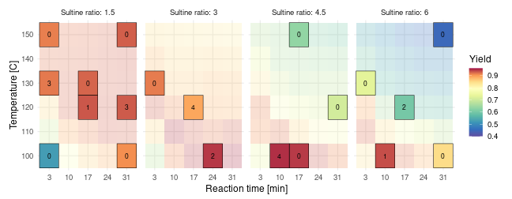
<p class="caption">Online I-optimal design augmentation (m=20)</p>
</div>

---

<div class="figure">
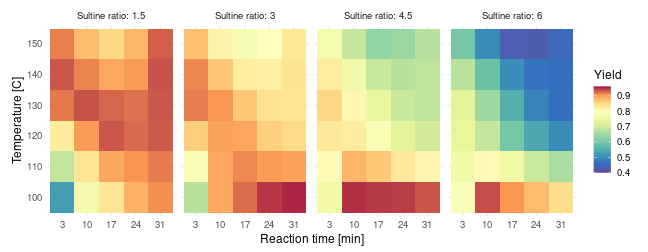
<p class="caption">Predicted yield based on augmented design (n=20)</p>
</div>

#### Robust design augmentation

In the previous example, we searched for the process parameters corresponding to the exact global optimum of the yield response. In practice, we may be more interested in process conditions that are close to optimal in terms of the product yield, but which are *robust* against slight deviations in the input parameters. More precisely, our aim is to find the conditions $\boldsymbol{x}^*$, such that the minimum yield is maximized within a small neighborhood around $\boldsymbol{x}^*$:

$$
\boldsymbol{x}^* = \arg\max_{\boldsymbol{x} \in \mathcal{X}} \min_{\boldsymbol{\delta} \in \Delta_\epsilon(\boldsymbol{x})} f(\boldsymbol{x} + \boldsymbol{\delta})
$$

where $\Delta_{\epsilon}(\boldsymbol{x}) = \{ \boldsymbol{x}' - \boldsymbol{x} : d(\boldsymbol{x}', \boldsymbol{x}) \leq \epsilon \}$ is a ball around $\boldsymbol{x}$ with radius $\epsilon$. This is equivalent to the robust optimization objective described by [@B18] in the context of Bayesian optimization with UCB acquisition.

To implement this robust objective, we revise the approach from the previous section by assigning costs based on the *minimum* predicted yield in a small neighborhood of each design point. As a neighborhood, we consider a deviation in temperature of 10°C, a deviation in reaction time of 7 minutes and zero deviation in the sultine ratio. Projected to the design grid, this corresponds to a $3 \times 3$ square of neighboring design points along the temperature and reaction time axes. Reusing the full quadratic linear model from the first example, we start from an initial D-optimal design of size $m_0 = 10$ and augment the design 5 times, each time by a single design point. We also increase the cost scaling parameter `alpha` putting more weight on optimization of the robustness objective (*exploitation*) and less on minimizing the D-criterion value (*exploration*).


``` r
## predict min. yield in small neighborhood
predict_min <- function(fit, newdata, eps = c(7, 0, 10)) {
  pred_yield <- predict(fit, newdata = newdata)
  conditions <- t(as.matrix(newdata))
  min_yield <- apply(conditions, 2, \(cond) {
    neighbors <- apply(abs(conditions - cond) <= eps, 2, all)
    min(pred_yield[neighbors])
  })
  return(min_yield)
}

## initial D-optimal design
design <- lm_design$new(
  formula = ~(temperature + reaction_time + sultine_conc)^2 + I(temperature^2) + I(reaction_time^2) + I(sultine_conc^2),
  data = apply(fullerenes[, -4], 2, scale),  ## standardized data columns
  alpha = 0.1                                ## cost scaling parameter
)
design$optimize(criterion = "D", return_value = FALSE)
init_design <- design$round(m = 10, method = "optimal", seed = 1)

n_iter <- 5
design_points <- which(init_design > 0)
design_weights <- init_design / sum(init_design)

for(i in 1:n_iter) {
  ## update cost function
  fit <- lm(update(design$formula, product_amount ~ .), data = fullerenes[design_points, ])
  design$update(cost = 1 - predict_min(fit, newdata = fullerenes))
  ## augment design
  design$augment(design_weights = design_weights, criterion = "D", return_value = FALSE)
  ## add point w/ highest weight
  design_points <- c(design_points, setdiff(order(design$design_weights, decreasing = TRUE), design_points)[1])
  design_weights[design_points] <- 1 / length(design_points)
}

## proposed design points
fullerenes[tail(design_points, n_iter), ]
#>     reaction_time sultine_conc temperature product_amount
#> 102            31          1.5         150      0.9291388
#> 120            31          6.0         150      0.4478669
#> 6               3          1.5         150      0.9151403
#> 103            31          3.0         100      0.9501030
#> 49             17          1.5         100      0.8574359
```

<div class="figure">
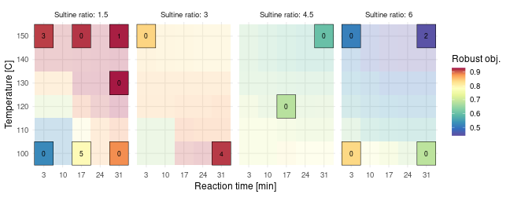
<p class="caption">Robust D-optimal design augmentation (m=15)</p>
</div>

### Imidazoles dataset

#### Screening and optimization design

As a third example, we load the `imidazoles` dataset [@S21, reaction 3], which reports experimental yields in a direct arylation reaction of imidazoles. Experimental yields have been measured across all combinations of 3 temperatures, 3 initial substrate concentrations, 4 base molecules, 4 solvent molecules and 12 ligand molecules, resulting in a total of 1728 experiments that allow to benchmark design approaches aimed at maximizing the yield.


``` r
imidazoles[, c("yield", "concentration", "temperature", "base", "solvent", "ligand")]
#>       yield concentration temperature   base  solvent        ligand
#> 1      5.47         0.100         105   KOAc     DMAc   BrettPhos-3
#> 2      0.00         0.100         105   KOAc     DMAc     PPhtBu2-3
#> 3     78.95         0.100         105   KOAc     DMAc tBPh-CPhos-21
#> 4      7.26         0.100         105   KOAc     DMAc       PCy3-11
#> 5     28.15         0.100         105   KOAc     DMAc       PPh3-29
#> 6     65.37         0.100         105   KOAc     DMAc      X-Phos-9
#> 7      0.07         0.100         105  KOPiv     DMAc   BrettPhos-3
#> 8      0.00         0.100         105  KOPiv     DMAc     PPhtBu2-3
#> 9     28.64         0.100         105  KOPiv     DMAc tBPh-CPhos-21
#> 10    10.44         0.100         105  KOPiv     DMAc       PCy3-11
....
```

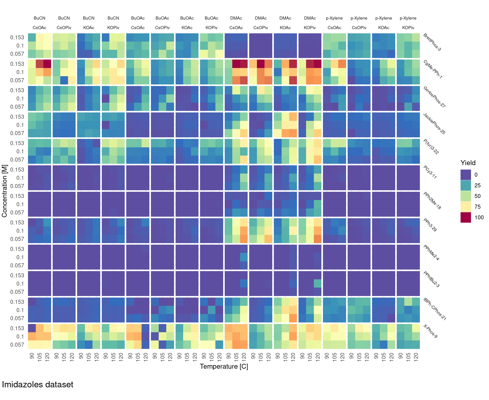

Assuming no initial knowledge of the yield response surface, we start from a saturated two-way interaction model including all main effects and first-order interactions. The linear model has 130 coefficients, so an I-optimal design of size 131 is calculated to ensure a non-singular information matrix. The approximate I-optimal design returned by `$optimize()` assigns almost equal weights across the design space due to the presence of the categorical factors (`base`, `solvent` and `ligand`). Uniformly distributed design weights provide no initial information when rounding to an exact design, so we skip the approximate design calculation with `$optimize()`. Instead, we directly start the point-exchange procedure with `$round()` using `design_weights = FALSE`, which initializes the procedure from a randomly sampled integer design. Since the local point-exchange optimization is initialized from a random design, the number of repetitions (`n_repeats`) of the procedure is increased compared to previous examples.


``` r
## standardize design columns
imidazoles_std <- transform(
  imidazoles[, c("concentration", "temperature", "base", "solvent", "ligand")],
  concentration = (concentration - 0.057) / 0.096, 
  temperature = (temperature - 90) / 30
)

design <- lm_design$new(
  formula = ~(concentration + temperature + base + solvent + ligand)^2,
  data = imidazoles_std
)
```


``` r
## initial I-optimal design
init_design <- design$round(m = 131, method = "optimal", criterion = "I", design_weights = FALSE, n_repeats = 1000, seed = 3)
```

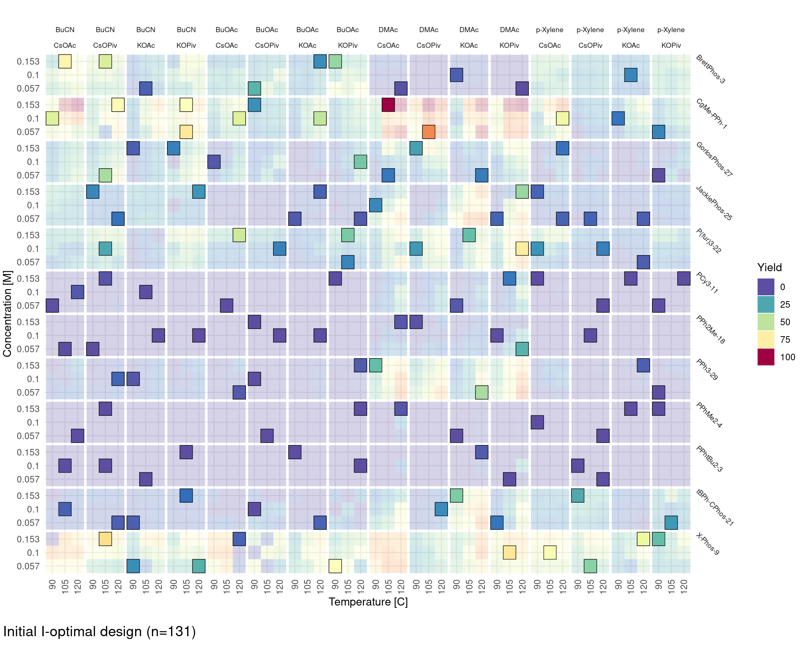

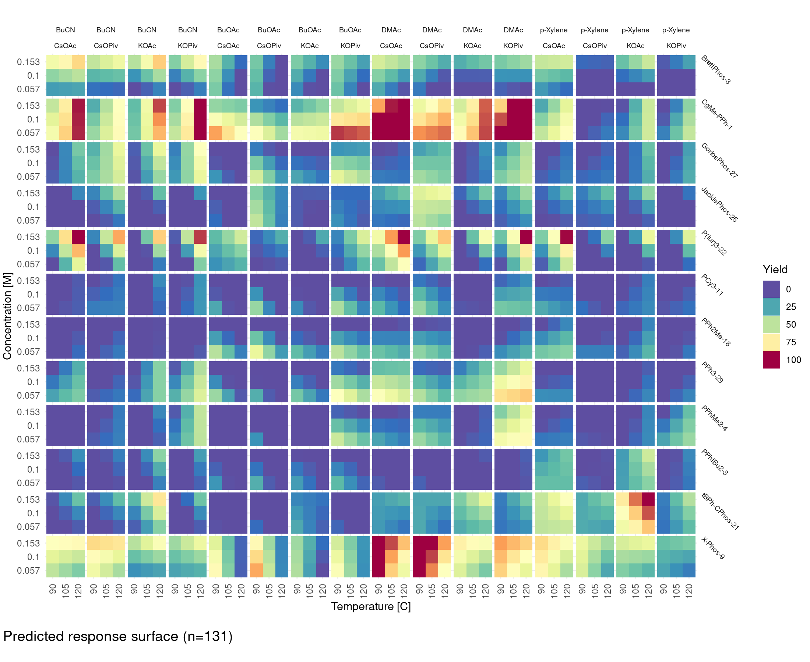

The optimal design strategy is appropriate to determine all reaction conditions that achieve a high experimental yield. A downside is that the number of required experiment runs ($m = 131$) may be too large for the available time and/or budget, especially in early-stage development of a reaction process. If the primary goal is to find reaction conditions that produce a high, but not necessarily globally optimal yield (e.g. > 99%), a common pragmatic approach is to split the design procedure into two stages: (1) a screening stage and (2) an optimization stage. In the first stage, we compute a small A-optimal design for a linear model including only the main effects for the `ligand` factors:


``` r
imidazoles_fct <- transform(imidazoles, ligand_fct = as.factor(ligand))

## first-stage screening design
design1 <- lm_design$new(
  formula = ~ligand_fct,
  data = imidazoles_fct,
  contrasts = list(
    ligand_fct = contr.sum(n = 12)   ## effects coding
  )
)

exact_design1 <- design1$round(m = 30, method = "optimal", criterion = "A", n_repeats = 100, design_weights = FALSE, seed = 1)
```

After evaluating the initial design of size $m_1 = 25$, we shrink the design space by selecting only the four most promising ligands: BrettPhos-3, CgMe-PPh-1, BPh-CPhos-21 and X-Phos-9. Note that we used sum contrasts (`contr.sum`) for easier interpretation of fitted ligand coefficients. Not many coefficients are significantly different from zero according to the linear model fit (with p-value $0.05$), so it is difficult to conclude with certainty which ligands should be kept for the optimization stage and which are safe to discard.


``` r
## fitted main effects
lm(
  formula = yield ~ ligand,
  data = imidazoles[exact_design1 > 0, ]
) |>
  summary()
#> 
#> Call:
#> lm(formula = yield ~ ligand, data = imidazoles[exact_design1 > 
#>     0, ])
#> 
#> Residuals:
#>     Min      1Q  Median      3Q     Max 
#> -37.535  -4.901   0.000   5.262  37.535 
#> 
#> Coefficients:
#>                     Estimate Std. Error t value Pr(>|t|)   
#> (Intercept)            31.36      10.57   2.967  0.00826 **
#> ligandCgMe-PPh-1        0.49      14.95   0.033  0.97421   
#> ligandGorlosPhos-27   -11.57      14.95  -0.774  0.44901   
#> ligandJackiePhos-25    -2.96      16.71  -0.177  0.86141   
#> ligandP(fur)3-22      -10.92      16.71  -0.653  0.52179   
#> ligandPCy3-11         -29.85      14.95  -1.997  0.06120 . 
#> ligandPPh2Me-18       -31.36      14.95  -2.098  0.05031 . 
#> ligandPPh3-29         -20.93      14.95  -1.400  0.17856   
#> ligandPPhMe2-4        -31.36      14.95  -2.098  0.05031 . 
#> ligandPPhtBu2-3       -31.36      16.71  -1.876  0.07693 . 
#> ligandtBPh-CPhos-21    10.05      16.71   0.602  0.55495   
#> ligandX-Phos-9          5.29      21.14   0.250  0.80525   
#> ---
#> Signif. codes:  0 '***' 0.001 '**' 0.01 '*' 0.05 '.' 0.1 ' ' 1
#> 
#> Residual standard error: 18.31 on 18 degrees of freedom
#> Multiple R-squared:  0.5117,	Adjusted R-squared:  0.2134 
#> F-statistic: 1.715 on 11 and 18 DF,  p-value: 0.1494
```


The second stage design is an I-optimal design for the full two-way interaction model. The model requires 58 coefficients on the reduced design space, but since there is a small overlap with the initial A-optimal design, a non-singular I-optimal design can be generated by augmenting the initial design with at least $m_2 \geq 49$ new experiments. Below, we generate the second-stage optimization of size $m_2 = 51$ leading to a total of $m = 60$ design points across the reduced design space:


``` r
## second-stage optimization design
design2 <- lm_design$new(
  formula = ~(concentration + temperature + base + solvent + ligand)^2,
  data = imidazoles1
)

mirai::daemons(n = 6, seed = 1)

exact_design2 <- design2$round(m = 51, method = "optimal", criterion = "I", augment_design = imidazoles1$exact_design1, design_weights = FALSE, n_repeats = 1000)

mirai::daemons(0)

```

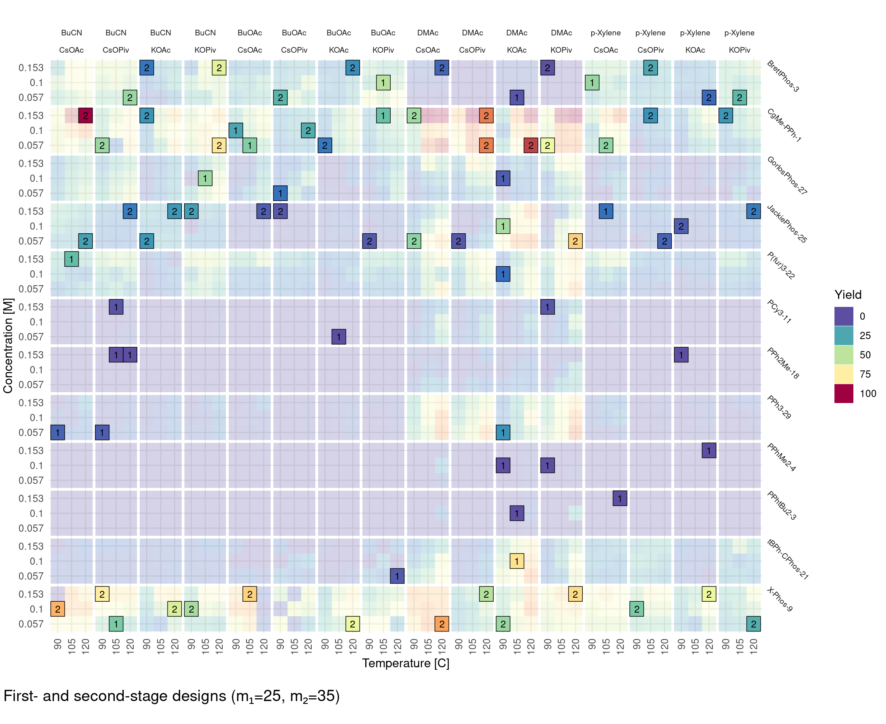

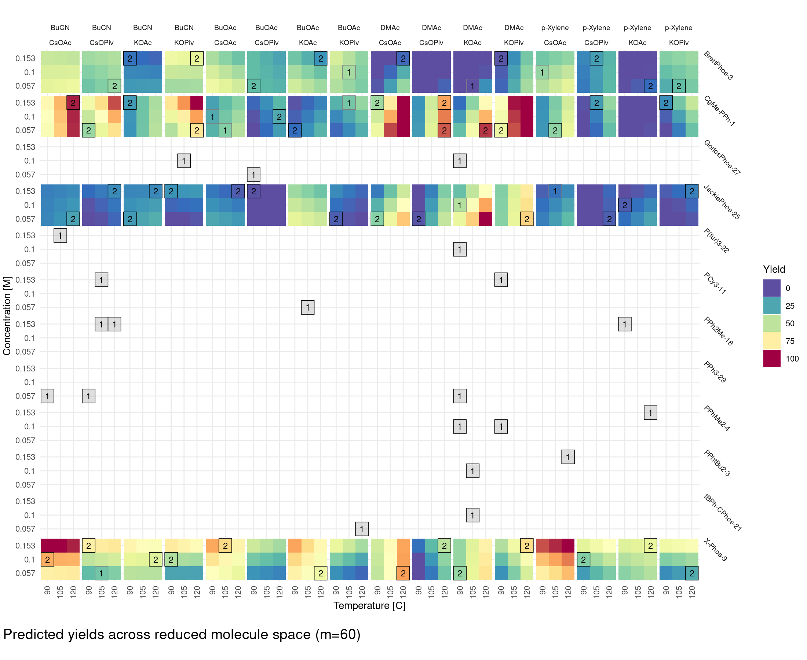

#### Sequential design augmentation

Moving beyond single- or two-stage designs, we can increase the number of design stages by considering a sequential or online design approach to maximize the yield. The initial design is a small regularized I-optimal design of size $m_0 = 15$ for the same saturated two-way interaction model as before including all main effects and first-order interactions. Since the number of model parameters $p = 130$ is (much) larger than the initial design size, a ridge penalty $\lambda = 10^{-2}$ is included to regularize the information matrix. 


``` r
design <- lm_design$new(
  formula = ~ (concentration + temperature + base + solvent + ligand)^2,
  data = imidazoles_std,
  lambda = 0.01
)
```

The I-optimal design is augmented 6 times by 10 new design points, using heterogeneous weights $\boldsymbol{v}$ at the $k$-th iteration that promote high responses according to:

$$
\boldsymbol{v}^{(k)}_i = \hat{y}(\boldsymbol{x}_i\, |\, \boldsymbol{\xi}^{(k)} ), \quad \text{for } i = 1,\ldots,n
$$

where $\hat{y}(\boldsymbol{x}_i | \boldsymbol{\xi}^{(k)})$ is the predicted response at $\boldsymbol{x}_i$ after evaluation of the design $\boldsymbol{\xi}^{(k)}$. The predictions $\hat{y}(\boldsymbol{x}_i)$ are made by a lasso regression model fitted to the available data at iteration $k$ with [glmnet](https://glmnet.stanford.edu/), using leave-one-out cross-validation to optimize the lasso penalty parameter. A lasso prediction model was chosen because the complete linear model cannot be fitted to a design of size $m < p$, as well as the presumption of sparseness, i.e. we expect the number of relevant model terms to be only a small fraction of the total number of coefficients $p$. 


``` r
## initial design
current_design <- design$round(
  m = 15,                 
  method = "optimal",
  n_repeats = 100,         
  criterion = "I",
  design_weights = FALSE   
)

for (iter in 1:6) {
  yhat <- predict_placeholder(current_design) ## lasso predictions
  design$update(
    lambda = 0.9 * design$lambda,
    weights = pmax(yhat, 0)
  )
  current_design <- design$round(
    m = 10,
    method = "optimal",
    augment_design = current_design,
    n_repeats = 100,
    criterion = "I",
    replicates = FALSE,
    design_weights = FALSE
  )
}
```

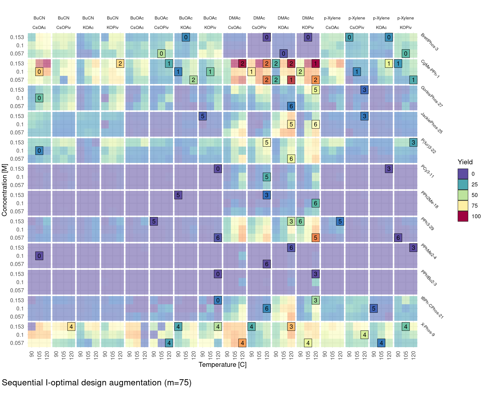

The (lasso) regression model correctly identifies the CgMe-PPh-1 ligand and the DMAc solvent as being important predictors for a high yield, which results in a strong bias in the proposed design points towards these ligand and solvent levels. The maximum observed yield in the design is 99.81% and the root mean squared error with respect to the target response surface is 17.28% ($R^2 = 0.507$). Interestingly, the root mean squared error of the lasso regression given an unweighted regularized I-optimal design of size $m = 75$ is 17.06% ($R^2 = 0.519$), which is only slightly lower. This is attributed to the fact that most of the signal is present in the high yield regions and exploration of the low yield regions only provides limited information to improve prediction accuracy. It should be noted that there is no guarantee that the global maximum is found by the sequentially augmented design as evidenced by the fact that not all regions of the candidate design space with high yields are fully explored (e.g. the interaction between BuCN and CgMe-PPh-1 or X-Phos-9). 

## References

