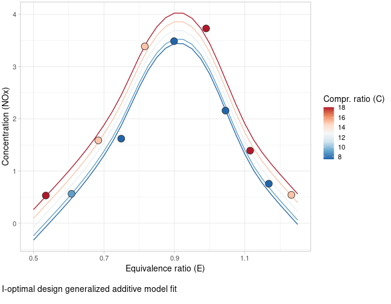
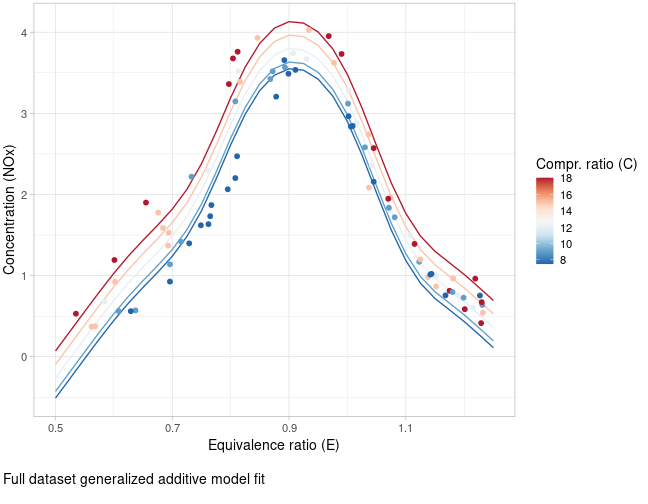
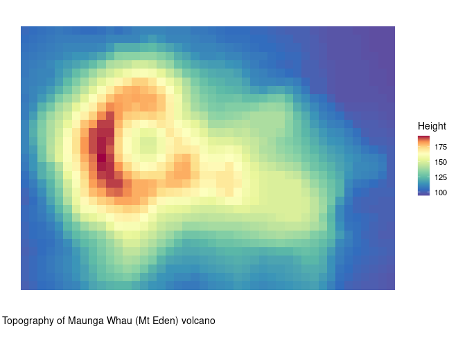
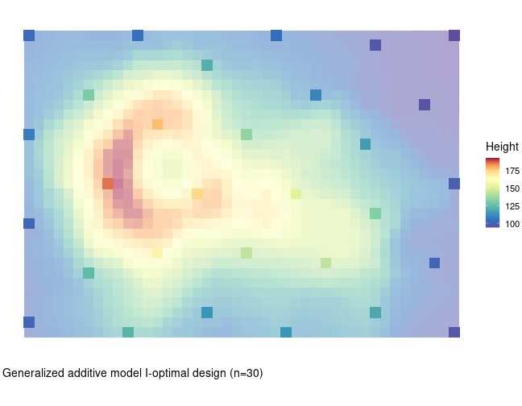
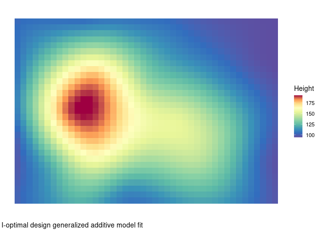

## Introduction

In `vignette("lm_design")`, the use of the `lm_design` [R6](https://r6.r-lib.org/articles/Introduction.html)-class is demonstrated to construct optimal designs for linear models. This vignette introduces the `glm_design` and `gam_design` [R6](https://r6.r-lib.org/articles/Introduction.html)-classes to calculate approximate and exact optimal designs for generalized linear and generalized additive models.

The methods available in the `glm_design` and `gam_design` classes are identical to those of the `lm_design` class, and it is recommended to read `vignette("lm_design")` before going through this vignette. The principal difference between optimal experiment design for generalized linear/additive models and linear models is that the information matrix of a generalized linear model is usually *not* independent of the model parameters $\boldsymbol{\theta}$, similar to the information matrix of a nonlinear model, as explained in `vignette("nlm_design")`.

### GLM information matrix

Recall that a generalized linear model is defined by an error distribution family $F$, a link function $g$ and a systematic (linear model) component $\eta(\boldsymbol{x}) = \boldsymbol{x}' \boldsymbol{\theta}$, where $\boldsymbol{x}$ is a $p$-dimensional design vector and $\boldsymbol{\theta}$ is the vector of model parameters of the same dimension. The error distribution family $F$ is assumed to be an [exponential dispersion family](https://en.wikipedia.org/wiki/Exponential_dispersion_model), which means that the probability density (or mass) function of the distribution family $F$ can be written in canonical form as:

$$
f(y\ |\ \zeta, \phi) = \exp\left( \tfrac{y \zeta - b(\zeta)}{a(\phi)} + c(y, \phi) \right)
$$

Here, $b(\zeta(\boldsymbol{x}))$ is the cumulant generating function, such that $\mu(\boldsymbol{x}) = E[Y | \boldsymbol{x}] = b'(\zeta(\boldsymbol{x}))$ and $V(\mu(\boldsymbol{x})) = b''(\zeta(\boldsymbol{x}))$, where the latter is the variance function expressed as a function of the mean. The systematic component $\eta$ is linked to the mean $\mu$ through the link function $g$:
$$
g(\mu(\boldsymbol{x})) = \eta(\boldsymbol{x}) = \boldsymbol{x}' \boldsymbol{\theta}
$$

Given the $(n \times p)$ design matrix $\boldsymbol{X}$ with rows $\boldsymbol{x}_1,\ldots,\boldsymbol{x}_n$, the $(p \times p)$ information matrix, conditional on the dispersion parameter $\phi$, is given by:

$$
M(\boldsymbol{w} | \boldsymbol{X}, \boldsymbol{\theta}, F, g, \boldsymbol{v}) \ = \ \sum_{i=1}^n w_i v_i u(\boldsymbol{x}_i, \boldsymbol{\theta}) \boldsymbol{x}_i \boldsymbol{x}_i'
$$

with weights $u(\boldsymbol{x}_i, \boldsymbol{\theta})$ capturing the heteroscedasticity of the error distribution family as:

$$
u(\boldsymbol{x}_i, \boldsymbol{\theta}) = \dfrac{1}{a(\phi)}\dfrac{1}{V(\mu(\boldsymbol{x_i}))[g'(\mu(\boldsymbol{x}_i))]^2}, \quad \quad i = 1,\ldots,n
$$
For a normal error distribution with identity link, $u(\boldsymbol{x}_i, \boldsymbol{\theta}) = \tfrac{1}{a(\phi)} = \tfrac{1}{\sigma^2}$ is constant, and we recover the usual information matrix of a linear model. In general, for a heteroscedastic distribution family or non-identity link function, $u(\boldsymbol{x}_i, \boldsymbol{\theta})$ depends on both  the design point $\boldsymbol{x}_i$ and the model parameters $\theta$.

For this reason, `glm_design` and `gam_design` only calculate *locally* optimal designs, conditional on a given vector of nominal parameter values $\boldsymbol{\theta}_0$. This should not be confused with Bayesian optimal design, where an expected optimality criterion is calculated by integrating over a (prior) distribution assigned to the parameters $\boldsymbol{\theta}$.

**Remark**: by default, an instance of class `gam_design` is initialized using a normal error distribution with identity link function (`family = gaussian(link = "identity")`). This means that, for this case only, no nominal parameter values $\boldsymbol{\theta}_0$ are needed, since the information matrix reduces to that of a linear model.

## Examples

### Generalized linear models

#### Non-conforming tiles experiment

To demonstrate (locally) optimal design calculation with the `glm_design` class, we consider two examples from [@L01]. The first example, originally analyzed in [@TW80], is an experiment involving tile manufacturing. The experiment measures proportions of non-conforming tiles (per sample of 100 tiles) subject to 7 binary factors (`x1` to `x7`). Following [@L01, Example 3], the tile proportions are modeled using a GLM with a binomial distribution, logit link function and main effects linear model for the systematic component. This means that the mean tile proportions satisfy:

$$
\mu(\boldsymbol{x}) = g^{-1}(\eta(\boldsymbol{x})) = \dfrac{1}{1 + \exp\left(-(\theta_0 + \sum_{i=1}^7 \theta_i x_i\right)}
$$

Based on data from an eight-run $2^{7-4}$ fractional factorial design, we obtain the initial parameter estimates $\boldsymbol{\theta}_0 = (-1.419, -0.578, 0.109, 0.266, -0.262, 0.434, -0.633, 0.425)$ by fitting the GLM.

Given the model formula, nominal parameter values $\boldsymbol{\theta}_0$ and a candidate design grid, the design object can be initialized with `glm_design$new()`:


``` r
library(cvxoptdes)

## design grid
data <- expand.grid(
  x1 = c(-1, 1),
  x2 = c(-1, 1),
  x3 = c(-1, 1),
  x4 = c(-1, 1),
  x5 = c(-1, 1),
  x6 = c(-1, 1),
  x7 = c(-1, 1)
)

design <- glm_design$new(
  formula = ~x1 + x2 + x3 + x4 + x5 + x6 + x7,     ## systematic component
  data = data,
  family = binomial(link = "logit"),
  theta = c(-1.419, -0.578, 0.109, 0.266, -0.262, 0.434, -0.633, 0.425)
)
```

After initializing the generalized linear model and candidate design grid, we use the `$optimize()` method to calculate an approximate (locally) D-optimal design:


``` r
## approximate optimal design
design$optimize(criterion = "D") |> round(2)
#>   [1] 0.00 0.00 0.04 0.00 0.02 0.00 0.00 0.00 0.00 0.00 0.00 0.00 0.00 0.00 0.04 0.00 0.00 0.00 0.00 0.00 0.01 0.06 0.05 0.00 0.06 0.00 0.02 0.00 0.00
#>  [30] 0.00 0.00 0.00 0.00 0.00 0.00 0.00 0.00 0.00 0.00 0.00 0.00 0.00 0.00 0.00 0.00 0.00 0.00 0.00 0.00 0.00 0.00 0.00 0.00 0.00 0.05 0.00 0.00 0.00
#>  [59] 0.00 0.00 0.00 0.00 0.00 0.00 0.04 0.00 0.00 0.00 0.02 0.02 0.00 0.04 0.00 0.00 0.03 0.00 0.04 0.00 0.00 0.00 0.00 0.04 0.04 0.02 0.05 0.00 0.00
#>  [88] 0.00 0.00 0.00 0.00 0.03 0.00 0.01 0.04 0.05 0.00 0.00 0.00 0.00 0.00 0.00 0.05 0.00 0.00 0.00 0.00 0.00 0.00 0.00 0.00 0.00 0.04 0.00 0.03 0.00
#> [117] 0.00 0.00 0.00 0.02 0.00 0.00 0.01 0.00 0.07 0.00 0.00 0.00
#> attr(,"criterion")
#> attr(,"criterion")$crit.value
#> [1] 0.1852786
#> 
#> attr(,"criterion")$crit
#> [1] "D"
```

To round the approximate D-optimal design to an exact (integer) design with a given number of observations, we proceed in the same way as in `vignette("lm_design")` using the `$round()` method:


``` r
## integer design w/ 8 design points
(exact_design <- design$round(m = 8, method = "optimal", seed = 1, n_repeats = 25))
#>   [1] 0 0 0 0 0 0 0 0 0 0 0 0 0 0 1 0 0 0 0 0 0 1 0 0 0 0 0 0 0 0 0 0 0 0 0 0 0 0 0 0 0 0 0 0 0 0 0 0 0 0 1 0 0 0 0 0 0 0 0 0 0 0 0 0 1 0 0 0 0 0 0 0
#>  [73] 0 0 0 0 0 0 0 0 0 0 0 0 0 0 1 0 0 0 0 1 0 0 0 0 0 0 0 0 0 0 0 1 0 0 0 0 0 0 0 0 0 0 0 0 0 0 0 0 0 0 0 0 1 0 0 0
#> attr(,"criterion")
#> attr(,"criterion")$crit
#> [1] "D"
#> 
#> attr(,"criterion")$crit.value
#> [1] 0.1706436
#> 
#> attr(,"criterion")$crit.rel.eff
#> [1] 0.9210111

design$subset(replicates = exact_design)
#>     x1 x2 x3 x4 x5 x6 x7
#> 15  -1  1  1  1 -1 -1 -1
#> 22   1 -1  1 -1  1 -1 -1
#> 51  -1  1 -1 -1  1  1 -1
#> 65  -1 -1 -1 -1 -1 -1  1
#> 87  -1  1  1 -1  1 -1  1
#> 92   1  1 -1  1  1 -1  1
#> 104  1  1  1 -1 -1  1  1
#> 125 -1 -1  1  1  1  1  1
```

All other methods available for objects of class `lm_design` can also be used for `glm_design` objects (e.g. `$stratify()`, `$augment()`, `$vcov()`, etc.). For comparison, we can evaluate the D-criterion of the original fractional factorial design:


``` r
## fractional factorial design w/ 8 design points
init_design <- c(0, 0, 0, 0, 0, 0, 0, 1, 0, 0, 0, 0, 0, 0, 0, 0, 0, 0, 0, 0,
                 0, 0, 0, 0, 0, 1, 0, 0, 0, 0, 0, 0, 0, 0, 0, 0, 0, 0, 0, 0, 0,
                 0, 1, 0, 0, 0, 0, 0, 0, 0, 0, 0, 1, 0, 0, 0, 0, 0, 0, 0, 0, 0,
                 0, 0, 0, 0, 0, 0, 0, 0, 0, 0, 0, 0, 0, 0, 1, 0, 0, 0, 0, 0, 1,
                 0, 0, 0, 0, 0, 0, 0, 0, 0, 0, 0, 0, 0, 0, 1, 0, 0, 0, 0, 0, 0,
                 0, 0, 0, 0, 0, 0, 0, 0, 0, 0, 0, 0, 0, 0, 0, 0, 0, 0, 0, 0, 0,
                 0, 0, 1)

design$subset(replicates = init_design)
#>     x1 x2 x3 x4 x5 x6 x7
#> 8    1  1  1 -1 -1 -1 -1
#> 26   1 -1 -1  1  1 -1 -1
#> 43  -1  1 -1  1 -1  1 -1
#> 53  -1 -1  1 -1  1  1 -1
#> 77  -1 -1  1  1 -1 -1  1
#> 83  -1  1 -1 -1  1 -1  1
#> 98   1 -1 -1 -1 -1  1  1
#> 128  1  1  1  1  1  1  1

## D-criterion
design$crit(init_design, criterion = "D")
#> [1] 0.126333
```

In terms of the ratio of D-criteria, the locally D-optimal design is 35% more efficient compared to the fractional factorial design reported in [@L01], but this is expected, since the optimality criterion is evaluated *conditional* on the nominal parameter values $\boldsymbol{\theta}_0$, whereas the fractional factorial design was constructed independent of the parameter values.

#### Defect semiconductor wafers

The second example is an experiment counting defects on wafers in a semiconductor manufacturing process [@L01, Example 5]. The counts are modeled using a GLM with a Poisson distribution and log-link function. The systematic component consists of a full quadratic model in terms of three continuous factors `x1`, `x2` and `x3`.

$$
\mu(\boldsymbol{x}) = g^{-1}(\eta(\boldsymbol{x})) = \exp\left( \theta_0 + \theta_1 x_1 + \theta_2 x_2 + \theta_3 x_3 + \theta_4 x_1^2 + \theta_5 x_2^2 + \theta_6x_3^2 + \theta_7 x_1x_2 + \theta_8 x_1 x_3 + \theta_9 x_2x_3  \right)
$$
An initial 18-run central composite design is reported in [@L01], where the factors are evaluated across 5 scaled levels: $\{ -1.732, -1, 0, 1, 1.732 \}$, which results in the parameter estimates $\boldsymbol{\theta}_0 = (1.9293, 0.6103, 0.7028, -0.3531, 0, 0.2471, 0, -0.5209, 0, 0)$. 

Given the model formula, nominal parameter values $\boldsymbol{\theta}_0$, and the candidate design grid, we calculate a locally D-optimal design of size $m = 18$. Similar to the central composite design, we constrain the candidate design grid so that the extremes $\{ -1.732, 1.732 \}$ can only occur in combination with zeros for the remaining factors. To accomplish this, we include only the allowed design points in the candidate design grid:


``` r
## candidate grid
data <- rbind(
  expand.grid(x1 = -1:1, x2 = -1:1, x3 = -1:1),
  data.frame(
    x1 = c(-1.732, 1.732, 0, 0, 0, 0),
    x2 = c(0, 0, -1.732, 1.732, 0, 0),
    x3 = c(0, 0, 0, 0, -1.732, 1.732)
  )
)

design <- glm_design$new(
  formula = ~(x1 + x2 + x3)^2 + I(x1^2) + I(x2^2) + I(x3^2),
  data = data,
  family = poisson(link = "log"),
  theta = c(1.9293, 0.6103, 0.7028, -0.3531, 0, 0.2471, 0, -0.5209, 0, 0)
)

## approximate D-optimal design
design$optimize(criterion = "D") |> round(2)
#>  [1] 0.00 0.00 0.09 0.00 0.00 0.00 0.09 0.00 0.09 0.00 0.00 0.00 0.00 0.00 0.00 0.00 0.10 0.00 0.00 0.00 0.10 0.00 0.00 0.00 0.10 0.00 0.09 0.02 0.08
#> [30] 0.09 0.09 0.06 0.00
#> attr(,"criterion")
#> attr(,"criterion")$crit.value
#> [1] 8.212697
#> 
#> attr(,"criterion")$crit
#> [1] "D"

## integer design w/ 18 design points
(exact_design <- design$round(m = 18, method = "optimal", seed = 1))
#>  [1] 0 0 1 0 0 0 2 0 2 0 0 0 0 0 0 0 2 0 0 0 2 0 0 0 2 0 1 0 1 2 2 1 0
#> attr(,"criterion")
#> attr(,"criterion")$crit
#> [1] "D"
#> 
#> attr(,"criterion")$crit.value
#> [1] 7.984934
#> 
#> attr(,"criterion")$crit.rel.eff
#> [1] 0.9722669

design$subset(replicates = exact_design)
#>          x1     x2     x3
#> 3     1.000 -1.000 -1.000
#> 7    -1.000  1.000 -1.000
#> 7.1  -1.000  1.000 -1.000
#> 9     1.000  1.000 -1.000
#> 9.1   1.000  1.000 -1.000
#> 17    0.000  1.000  0.000
#> 17.1  0.000  1.000  0.000
#> 21    1.000 -1.000  1.000
#> 21.1  1.000 -1.000  1.000
#> 25   -1.000  1.000  1.000
#> 25.1 -1.000  1.000  1.000
#> 27    1.000  1.000  1.000
#> 29    1.732  0.000  0.000
#> 30    0.000 -1.732  0.000
#> 30.1  0.000 -1.732  0.000
#> 31    0.000  1.732  0.000
#> 31.1  0.000  1.732  0.000
#> 32    0.000  0.000 -1.732
```

The locally D-optimal design is 15% more efficient than the central composite design in terms of the ratio of D-criteria. Again, this is not surprising as the D-optimal design was generated conditional on the nominal parameter values $\boldsymbol{\theta}_0$. Note that a D-optimal design based on the systematic component viewed as a linear model is only 4.3% more efficient than the central composite design.


``` r
## central composite design w/ 18 design points
init_design <- c(1, 0, 1, 0, 0, 0, 1, 0, 1, 0, 0, 0, 0, 4, 0, 0, 0, 0, 1, 0, 1, 0, 0, 0, 1, 0, 1, 1, 1, 1, 1, 1, 1)
design$subset(replicates = init_design)
#>          x1     x2     x3
#> 1    -1.000 -1.000 -1.000
#> 3     1.000 -1.000 -1.000
#> 7    -1.000  1.000 -1.000
#> 9     1.000  1.000 -1.000
#> 14    0.000  0.000  0.000
#> 14.1  0.000  0.000  0.000
#> 14.2  0.000  0.000  0.000
#> 14.3  0.000  0.000  0.000
#> 19   -1.000 -1.000  1.000
#> 21    1.000 -1.000  1.000
#> 25   -1.000  1.000  1.000
#> 27    1.000  1.000  1.000
#> 28   -1.732  0.000  0.000
#> 29    1.732  0.000  0.000
#> 30    0.000 -1.732  0.000
#> 31    0.000  1.732  0.000
#> 32    0.000  0.000 -1.732
#> 33    0.000  0.000  1.732

## D-criterion
design$crit(init_design, criterion = "D")
#> [1] 6.939439
```

### Generalized additive models

The `glm_design` class accepts only linear model formulas for the systematic component $\eta(\boldsymbol{x})$ of the GLM. With the `gam_design` class, a GAM formula including smooth terms `s`, `te`, `ti` and `t2` using [mgcv](https://stat.ethz.ch/R-manual/R-devel/library/mgcv/html/formula.gam.html) formula syntax can be specified for the systematic component of the model. By default, a Gaussian error distribution with identity link function is assumed for the generalized additive model (`family = gaussian()`), in which case the information matrix is independent of the model parameters. If a different error distribution family is specified, then a nominal set of parameter values (`theta`) must be provided as well, analogous to the `glm_design` class.

#### Ethanol dataset

To illustrate optimal design calculation for generalized additive models with the `gam_design` class, we load the `ethanol` dataset [@RWC03]. This dataset reports measurements from an experiment in which ethanol was burned in a single cylinder automobile test engine. There are two continuous predictors: the compression ratio of the engine (`C`), and the equivalence ratio at which the engine was run (`E`). The response variable is the concentration of nitric oxide (NO) and nitrogen dioxide (NO2) in engine exhaust (`NOx`). As a model for the `NOx` response, we consider a simple GAM consisting of a smooth term (`s(E)`) modeling the effect of the equivalence ratio and a linear effect for the compression ratio (`C`). The errors are assumed to be homoscedastic and normally distributed, so no nominal parameter values `theta` need to be specified.


``` r
## initialize model
design <- gam_design$new(
  formula = ~s(E) + C,
  data = ethanol
)

design$data
#>      NOx    C     E
#> 1  3.741 12.0 0.907
#> 2  2.295 12.0 0.761
#> 3  1.498 12.0 1.108
#> 4  2.881 12.0 1.016
#> 5  0.760 12.0 1.189
#> 6  3.120  9.0 1.001
#> 7  0.638  9.0 1.231
#> 8  1.170  9.0 1.123
#> 9  2.358 12.0 1.042
#> 10 0.606 12.0 1.215
....
```

After initialization of the `gam_design` object, we compute an I-optimal design in the same way as for an object of class `glm_design`. The smooth term `s(E)` has $k=10$ basis functions (and 10 coefficients), which means that the exact I-optimal design requires at least $m=11$ design points for a non-singular information matrix and non-zero optimality criterion.


``` r
## approximate optimal design
design$optimize(criterion = "I") |> round(2)
#>  [1] 0.00 0.00 0.00 0.00 0.00 0.00 0.04 0.00 0.00 0.00 0.00 0.00 0.00 0.03 0.02 0.00 0.00 0.00 0.04 0.00 0.00 0.06 0.00 0.00 0.03 0.00 0.00 0.00 0.00
#> [30] 0.00 0.00 0.00 0.00 0.00 0.00 0.04 0.00 0.04 0.00 0.04 0.00 0.05 0.03 0.00 0.00 0.00 0.00 0.00 0.00 0.05 0.03 0.00 0.00 0.00 0.01 0.08 0.00 0.04
#> [59] 0.00 0.07 0.05 0.00 0.00 0.06 0.05 0.00 0.00 0.00 0.00 0.00 0.00 0.00 0.00 0.00 0.00 0.00 0.00 0.00 0.00 0.00 0.05 0.00 0.00 0.05 0.00 0.00 0.04
#> [88] 0.00
#> attr(,"criterion")
#> attr(,"criterion")$crit.value
#> [1] 0.1028822
#> 
#> attr(,"criterion")$crit
#> [1] "I"

## integer design w/ 11 design points
(exact_design <- design$round(m = 11, method = "optimal", criterion = "I", seed = 1))
#>  [1] 0 0 0 0 0 0 0 0 0 0 0 0 0 0 0 0 0 0 0 0 0 0 0 0 0 0 0 0 0 0 0 0 1 0 0 0 0 0 0 1 0 1 0 0 0 0 0 0 0 0 0 0 0 0 0 1 0 0 0 1 1 0 0 0 0 0 0 0 0 0 0 0 0
#> [74] 1 0 0 1 0 0 0 1 0 0 1 0 0 1 0
#> attr(,"criterion")
#> attr(,"criterion")$crit
#> [1] "I"
#> 
#> attr(,"criterion")$crit.value
#> [1] 0.09616473
#> 
#> attr(,"criterion")$crit.rel.eff
#> [1] 0.9347068
```

The first figure below displays the selected design points in the calculated I-optimal design, as well as the predicted `NOx` concentrations based on the GAM fitted to the design of size $m=11$. To compare, the second figure displays the same GAM fitted to the full dataset of size $n=88$.



---



#### Volcano height dataset

As a second example, we load the `volcano` dataset, which contains topographic information of the Maunga Whau (Mt Eden) volcano in the Auckland volcano field. To reduce computational effort, we first downsample the `volcano` data, resulting in volcano heights across a $(44 \times 31)$-dimensional matrix with rows corresponding to grid lines running east to west and columns to grid lines running south to north.


``` r
## initialize data
data(volcano)

volcano <- volcano[c(TRUE, FALSE), c(TRUE, FALSE)]

data <- expand.grid(
  x1 = seq_len(dim(volcano)[1]),
  x2 = seq_len(dim(volcano)[2])
)
data[["y"]] <- c(volcano)
```



To capture the smoothly varying volcano height, we consider a general two-dimensional (isotropic) smooth `~s(x1, x2)` with a total of $k = 30$ basis functions. Given the model and 2D data grid, we calculate an I-optimal design of size $m=30$. Note that we skip the optimization of the approximate design and directly run 100 repeats of the point-exchange procedure in parallel with `mirai`. Setting `design_weights = FALSE`, the integer designs used as starting points for the point-exchange are initialized by random sampling.


``` r
## initialize model
design <- gam_design$new(
  formula = ~s(x1, x2),
  data = data
)

## parallel evaluation
mirai::daemons(n = parallel::detectCores() / 2, seed = 1)

exact_design <- design$round(m = 30, method = "optimal", criterion = "I", n_repeats = 100, design_weights = FALSE)

mirai::daemons(0)

design$crit(exact_design, criterion = "I")
#> [1] 0.0341186
```

The resulting I-optimal design is a type of space-filling design as shown in the figure below, which makes sense as the accuracy of the GAM regression splines increases with design points that are evenly spread across the 2D grid. The second figure
displays the predicted volcano height based on the GAM fitted to the selected design points in the I-optimal design. A rough outline of the volcano is present in the GAM predicted surface, but the more detailed volcano ridges are not yet visible. To achieve more accuracy in predicting the volcano ridges, we can construct a second (optimization) design focused on the area where the volcano height is high. This approach is discussed in more detail in `vignette("augment_design")`.



---




## References

