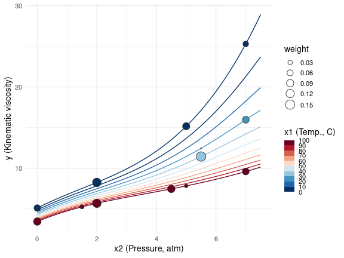
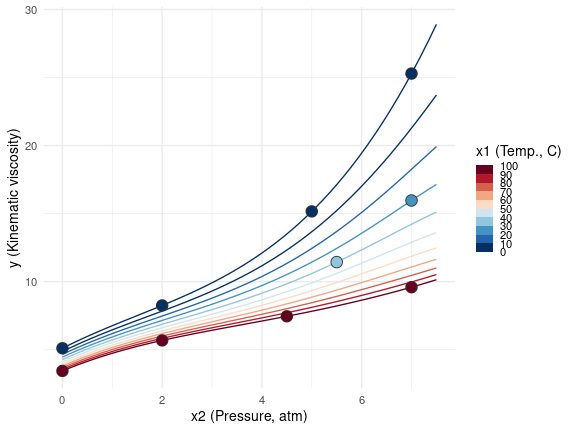
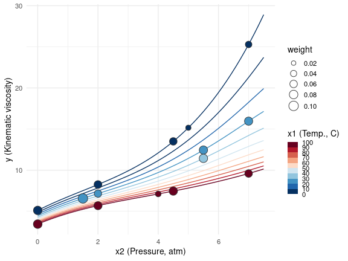
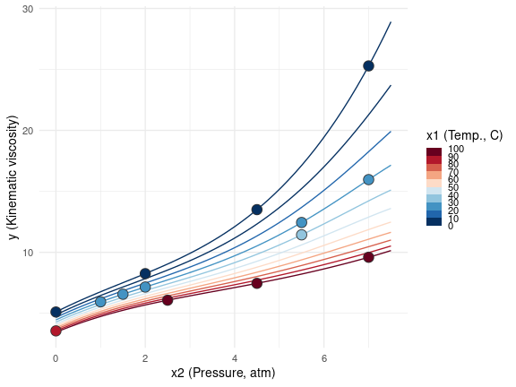
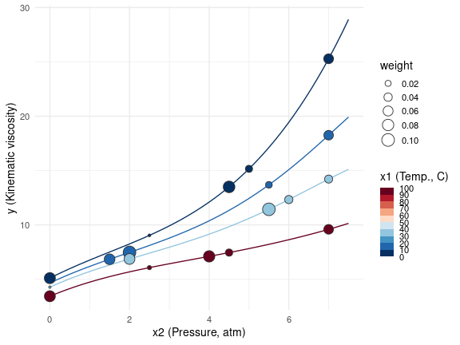
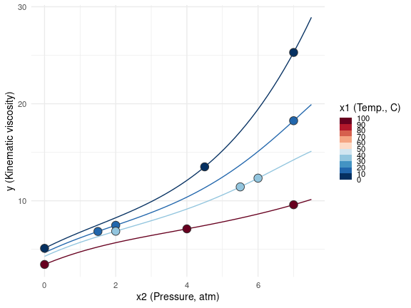
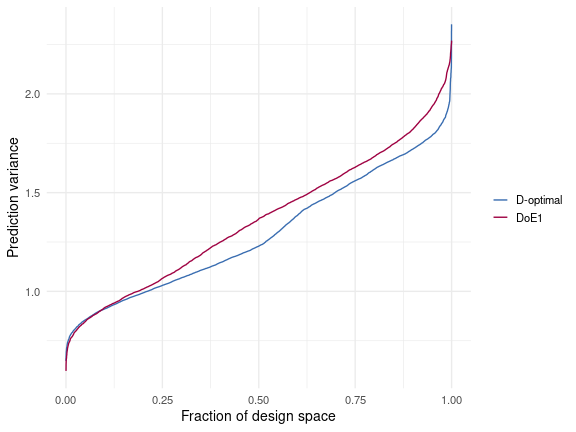

## Nonlinear model optimal design

In `vignette("lm_design")`, the use of the `lm_design` [R6](https://r6.r-lib.org/articles/Introduction.html)-class is demonstrated to construct optimal designs for linear models. This vignette introduces the `nlm_design` and `lme_design` [R6](https://r6.r-lib.org/articles/Introduction.html)-classes to calculate approximate and exact optimal designs for nonlinear models and random intercept linear mixed models.

The methods available in the `nlm_design` class are largely equivalent to those in the `lm_design` class. The principal difference is that the information matrix of a nonlinear model $f$ is *not* independent of the model parameters $\boldsymbol{\theta}$. Denote $F(\boldsymbol{x}_i, \boldsymbol{\theta})$ for the gradient vector of the nonlinear model $f$ with respect to the model parameters $\boldsymbol{\theta}$ evaluated at $\boldsymbol{x}_i$, i.e. the $i$-th row of the Jacobian matrix. Then, conditional on the error variance $\sigma_e^2$, the $(p \times p)$-information matrix is:

$$
M(\boldsymbol{w} | \boldsymbol{X}, \boldsymbol{\theta}, \boldsymbol{v}) \ = \ \frac{1}{\sigma_e^2}\sum_{i = 1}^n w_i v_i F(\boldsymbol{x}_i, \boldsymbol{\theta}) F(\boldsymbol{x}_i, \boldsymbol{\theta})'
$$

For a linear model, the information matrix becomes independent of the parameters $\boldsymbol{\theta}$ and simplifies to the usual form:

$$
M(\boldsymbol{w}\ |\ \boldsymbol{X}, \boldsymbol{v}) \ = \ \frac{1}{\sigma_e^2} \sum_{i = 1}^n w_i v_i \boldsymbol{x}_i \boldsymbol{x}_i'
$$

In the general nonlinear case, `nlm_design` only calculates *locally* optimal designs, conditional on a given vector of nominal parameter values $\boldsymbol{\theta}_0$. This should not be confused with Bayesian optimal design for nonlinear models, where an expected optimality criterion is calculated by integrating over a (prior) distribution assigned to the parameters $\boldsymbol{\theta}$.

### Lubricant dataset

The calculation of a locally I-optimal design with the `nlm_design` class is demonstrated using the Lubricant dataset from [@BW88, Appendix 1, A1.8]. The kinematic viscosity of a lubricant (`y`) is described as a function of temperature `x1` (in °C) and pressure `x2` (in atm) by the following 9-parameter empirical nonlinear model:

$$
f(x_1, x_2, \boldsymbol{\theta}) = \frac{\theta_1}{\theta_2 + x_1} + \theta_3 x_2 + \theta_4 x_2^2 + \theta_5 x_2^3 + (\theta_6 x_2 + \theta_7 x_2^3) \exp\left(\frac{-x_1}{\theta_8 + \theta_9 x_2^2} \right)
$$

Based on the available dataset in [@BW88], nonlinear least squares parameter estimates were obtained as $\boldsymbol{\theta}_0 = (1054.541, 206.546, 1.46, -0.26, 0.023, 0.401, 0.035, 57.405, -0.477)$. Given the model formula, nominal parameter values $\boldsymbol{\theta}_0$ and a candidate design grid, the design object can be initialized with `nlm_design$new()`:


``` r
library(cvxoptdes)

## design grid
data <- expand.grid(
  x1 = seq(from = 0, to = 100, by = 10), ## temp. (C)
  x2 = seq(from = 0, to = 7, by = 0.5)   ## pressure (atm)
)

design <- nlm_design$new(
  formula = ~b1/(b2 + x1) + b3 * x2 + b4 * x2^2 + b5 * x2^3 + (b6 * x2 + b7 * x2^3) * exp(-x1/(b8 + b9 * x2^2)),
  theta = c(b1 = 1054.541, b2 = 206.546, b3 = 1.46, b4 = -0.26, b5 = 0.023, b6 = 0.401, b7 = 0.035, b8 = 57.405, b9 = -0.477),
  data = data
)
```

#### Approximate optimal design

After initializing the nonlinear model and design grid, we use the `$optimize()` method to calculate an approximate (locally) I-optimal design:


``` r
design$optimize(criterion = "I") |> round(2)
#>   [1] 0.07 0.00 0.00 0.00 0.00 0.00 0.00 0.00 0.00 0.00 0.10 0.00 0.00 0.00 0.00 0.00 0.00 0.00 0.00 0.00 0.00 0.00 0.00 0.00 0.00 0.00 0.00 0.00 0.00
#>  [30] 0.00 0.00 0.00 0.00 0.00 0.00 0.00 0.00 0.00 0.00 0.00 0.00 0.00 0.00 0.02 0.13 0.00 0.00 0.00 0.00 0.00 0.00 0.00 0.00 0.00 0.12 0.00 0.00 0.00
#>  [59] 0.00 0.00 0.00 0.00 0.00 0.00 0.00 0.00 0.00 0.00 0.00 0.00 0.00 0.00 0.00 0.00 0.00 0.00 0.00 0.00 0.00 0.00 0.00 0.00 0.00 0.00 0.00 0.00 0.00
#>  [88] 0.00 0.00 0.00 0.00 0.00 0.00 0.00 0.00 0.00 0.00 0.00 0.00 0.00 0.00 0.00 0.00 0.00 0.00 0.00 0.00 0.00 0.00 0.10 0.09 0.00 0.00 0.00 0.00 0.00
#> [117] 0.00 0.00 0.00 0.00 0.02 0.00 0.00 0.00 0.00 0.15 0.00 0.00 0.00 0.00 0.00 0.00 0.00 0.00 0.00 0.00 0.00 0.00 0.00 0.00 0.00 0.00 0.00 0.00 0.00
#> [146] 0.00 0.00 0.00 0.00 0.00 0.00 0.00 0.00 0.00 0.05 0.00 0.00 0.08 0.00 0.00 0.00 0.00 0.00 0.00 0.08
#> attr(,"criterion")
#> attr(,"criterion")$crit.value
#> [1] 0.1770624
#> 
#> attr(,"criterion")$crit
#> [1] "I"
```

Below, the optimized design weights are shown in the $(x_1, x_2, y)$ space by evaluating the viscosity response based on $f(x_1, x_2, \boldsymbol{\theta}_0)$. Larger design weights are displayed with a larger circle radius.

<div class="figure">

<p class="caption">Approximate locally I-optimal design</p>
</div>

#### Exact optimal design

To round the approximate I-optimal design to an exact (integer) design with a given number of observations, we proceed in the same way as in `vignette("lm_design")` using the `$round()` method:


``` r
## integer design w/ 11 design points
(exact_design <- design$round(m = 11, method = "optimal", seed = 1))
#>   [1] 1 0 0 0 0 0 0 0 0 0 1 0 0 0 0 0 0 0 0 0 0 0 0 0 0 0 0 0 0 0 0 0 0 0 0 0 0 0 0 0 0 0 0 0 1 0 0 0 0 0 0 0 0 0 1 0 0 0 0 0 0 0 0 0 0 0 0 0 0 0 0 0
#>  [73] 0 0 0 0 0 0 0 0 0 0 0 0 0 0 0 0 0 0 0 0 0 0 0 0 0 0 0 0 0 0 0 0 0 0 0 0 0 1 1 0 0 0 0 0 0 0 0 0 0 0 0 0 0 2 0 0 0 0 0 0 0 0 0 0 0 0 0 0 0 0 0 0
#> [145] 0 0 0 0 0 0 0 0 0 0 1 0 0 1 0 0 0 0 0 0 1
#> attr(,"criterion")
#> attr(,"criterion")$crit
#> [1] "I"
#> 
#> attr(,"criterion")$crit.value
#> [1] 0.1644273
#> 
#> attr(,"criterion")$crit.rel.eff
#> [1] 0.9286403
```

<div class="figure">

<p class="caption">Rounded (integer) design with m=11 design points</p>
</div>

Other rounding procedures that can be used are `"efficient"`, `"dist-min"` and `"dist-sum"` as explained in `vignette("lm_design")` for linear models.

#### Penalized optimal design

Heterogeneous weights and cost penalties are included in the approximate optimal design problem via the `$weights` and `$cost` fields as described in `vignette("lm_design")`. For the lubricant example, we can penalize temperatures different from 25°C and 1 atm, as these conditions may be more difficult (or costly) to evaluate experimentally. In addition, we constrain the design weights from above using the `upper` argument to increase the spread of the design weights and avoid that all weights are assigned to one or a few design points.


``` r
design$update(
  cost = ~abs(x1 - 25) / 100 + abs(x2 - 1) / 7,                  ## condition weights
  alpha = 0.1,                                                   ## cost scaling parameter
  upper = 0.1                                                    ## max weight per point
)

## re-optimize
design$optimize(criterion = "I") |> round(2)
#>   [1] 0.08 0.00 0.00 0.00 0.00 0.00 0.00 0.00 0.00 0.01 0.08 0.00 0.00 0.00 0.00 0.00 0.00 0.00 0.00 0.00 0.00 0.00 0.00 0.00 0.00 0.00 0.00 0.00 0.00
#>  [30] 0.00 0.00 0.00 0.00 0.00 0.00 0.00 0.10 0.00 0.00 0.00 0.00 0.00 0.00 0.00 0.07 0.00 0.00 0.06 0.00 0.00 0.00 0.00 0.00 0.00 0.07 0.00 0.00 0.00
#>  [59] 0.00 0.00 0.00 0.00 0.00 0.00 0.00 0.00 0.00 0.00 0.00 0.00 0.00 0.00 0.00 0.00 0.00 0.00 0.00 0.00 0.00 0.00 0.00 0.00 0.00 0.00 0.00 0.00 0.00
#>  [88] 0.00 0.00 0.00 0.00 0.00 0.00 0.00 0.00 0.00 0.00 0.00 0.03 0.06 0.00 0.00 0.00 0.00 0.00 0.00 0.00 0.00 0.00 0.08 0.03 0.00 0.00 0.00 0.00 0.00
#> [117] 0.00 0.00 0.00 0.00 0.00 0.00 0.00 0.00 0.08 0.08 0.00 0.00 0.00 0.00 0.00 0.00 0.00 0.00 0.00 0.00 0.00 0.00 0.00 0.00 0.00 0.00 0.00 0.00 0.00
#> [146] 0.00 0.00 0.00 0.00 0.00 0.00 0.00 0.00 0.00 0.04 0.00 0.00 0.07 0.00 0.00 0.00 0.00 0.00 0.00 0.06
#> attr(,"criterion")
#> attr(,"criterion")$crit.value
#> [1] 0.09436276
#> 
#> attr(,"criterion")$crit
#> [1] "I"
```

Compared to Figure 1, more weight is assigned to the lower pressure and temperature conditions. Also, the weights are more spread out across the design space due the `upper` limit constraint on the design weights:

<div class="figure">

<p class="caption">Penalized approximate locally I-optimal design</p>
</div>

If cost penalties are present in the `$cost` field, these are passed down to the point-exchange objective function when calling `$round()` with method `"optimal"`. 


``` r
## optimal rounding w/ penalization
(exact_design <- design$round(m = 14, method = "optimal", seed = 1))
#>   [1] 1 0 0 0 0 0 0 0 0 1 0 0 0 0 0 0 0 0 0 0 0 0 0 0 0 1 0 0 0 0 0 0 0 0 0 0 1 0 0 0 0 0 0 0 1 0 0 1 0 0 0 0 0 0 0 0 0 0 0 0 0 0 0 0 0 1 0 0 0 0 0 0
#>  [73] 0 0 0 0 0 0 0 0 0 0 0 0 0 0 0 0 0 0 0 0 0 0 0 0 0 0 0 1 0 0 0 0 0 0 0 0 0 1 0 0 0 0 0 0 0 0 0 0 0 0 0 0 1 1 0 0 0 0 0 0 0 0 0 0 0 0 0 0 0 0 0 0
#> [145] 0 0 0 0 0 0 0 0 0 0 1 0 0 1 0 0 0 0 0 0 1
#> attr(,"criterion")
#> attr(,"criterion")$crit
#> [1] "I"
#> 
#> attr(,"criterion")$crit.value
#> [1] 0.08771622
#> 
#> attr(,"criterion")$crit.rel.eff
#> [1] 0.929564
```

<div class="figure">

<p class="caption">Rounded penalized (integer) design with m=14 design points</p>
</div>

#### Stratified optimal design

Stratification constraints are added to the design problem using the `$stratify()` method. This is analogous to the `$stratify()` method in `vignette("lm_design")`. To illustrate with the current example, we first subset the 0°C, 20°C, 40°C and 100°C conditions from the design grid and discard the other temperature conditions. Second, we impose the stratification constraint that each temperature condition is represented equally in the approximate I-optimal design:


``` r
design$update(
  cost = NULL,   ## drop cost penalties
  data = subset(data, x1 %in% c(0, 20, 40, 100))
)

## partition design space by temperature conditions
## by default, equal weight proportions are assigned to each condition
design$stratify(
  strata = ~x1
)

design$strata
#> $strata
#>  [1] 0   20  40  100 0   20  40  100 0   20  40  100 0   20  40  100 0   20  40  100 0   20  40  100 0   20  40  100 0   20  40  100 0   20  40  100
#> [37] 0   20  40  100 0   20  40  100 0   20  40  100 0   20  40  100 0   20  40  100 0   20  40  100
#> Levels: 0 20 40 100
#> 
#> $proportions
#> [1] 0.25 0.25 0.25 0.25

## stratified optimal design
design$optimize(criterion = "I") |> round(2)
#>  [1] 0.08 0.00 0.00 0.07 0.00 0.00 0.00 0.00 0.00 0.00 0.00 0.00 0.00 0.07 0.00 0.00 0.00 0.10 0.07 0.00 0.00 0.00 0.00 0.01 0.00 0.00 0.00 0.00 0.00
#> [30] 0.00 0.00 0.00 0.00 0.00 0.00 0.08 0.08 0.00 0.00 0.03 0.03 0.00 0.00 0.00 0.00 0.02 0.10 0.00 0.00 0.00 0.04 0.00 0.00 0.00 0.00 0.00 0.06 0.06
#> [59] 0.04 0.06
#> attr(,"criterion")
#> attr(,"criterion")$crit.value
#> [1] 0.1440584
#> 
#> attr(,"criterion")$crit
#> [1] "I"

## verify stratification
tapply(design$design_weights, design$data$x1, sum)
#>    0   20   40  100 
#> 0.25 0.25 0.25 0.25
```

<div class="figure">

<p class="caption">Stratified approximate locally I-optimal design</p>
</div>

If stratification constraints are present in the `$strata` field, these are passed down to the point-exchange objective function when calling `$round()` with method `"optimal"`. The same is true for `"dist-sum"` and `"dist-min"` rounding. For `"efficient"` rounding, stratification constraints are not enforced explicitly.


``` r
## optimal rounding w/ stratification
(exact_design <- design$round(m = 12, method = "optimal", seed = 1))
#>  [1] 1 0 0 1 0 0 0 0 0 0 0 0 0 1 0 0 0 1 1 0 0 0 0 0 0 0 0 0 0 0 0 0 0 0 0 1 1 0 0 0 0 0 0 0 0 0 1 0 0 0 1 0 0 0 0 0 1 1 0 1
#> attr(,"criterion")
#> attr(,"criterion")$crit
#> [1] "I"
#> 
#> attr(,"criterion")$crit.value
#> [1] 0.1362853
#> 
#> attr(,"criterion")$crit.rel.eff
#> [1] 0.946042
#> 
#> attr(,"strata")
#>   0  20  40 100 
#>   3   3   3   3
```

<div class="figure">

<p class="caption">Rounded stratified (integer) design with m=12 design points</p>
</div>

## Linear mixed model optimal design

Another family of parametric models that is widely used in practice for experiment design are (Gaussian) linear mixed models of the form $\boldsymbol{X}\boldsymbol{\theta} + \boldsymbol{Z}\boldsymbol{u} + \boldsymbol{\epsilon}$. The random effect covariates in $\boldsymbol{Z}$ represent nuisance variables that are not of primary interest or uncontrollable by the experimenter, but still influence the response by introducing correlation between observations with the same factor levels (e.g. batch or subject effects, or varying environmental conditions). If the nuisance factors in $\boldsymbol{Z}$ are ignored in the design, the estimation error in the model parameters of interest $\boldsymbol{\theta}$ may be sub-optimal due to the random effects correlation between observations.

The `lme_design` [R6](https://r6.r-lib.org/articles/Introduction.html)-class supports penalized design optimization only for the class of *random intercept* (Gaussian) linear mixed models with a single random intercept variance component $\sigma_u^2$. In this context, the variance-covariance matrix of the observations $\text{Cov}(\boldsymbol{y})$ is block-diagonal and given by:

$$
\boldsymbol{V} = \sigma_e^2 \left(\boldsymbol{I}_n + \eta \boldsymbol{Z}\boldsymbol{Z}'\right)
$$

where $\sigma_e^2$ is the variance of the (i.i.d.) errors $\boldsymbol{\epsilon}$ and the ratio $\eta = \sigma_u^2 / \sigma_e^2$ measures the relative amount of correlation within random effects levels (cf. [@G02, Ch. 3-4]). Conditional on the variance ratio $\eta$, the $(p \times p)$-information matrix is:

$$
M(\boldsymbol{w}\,|\,\boldsymbol{X}, \boldsymbol{v}, \boldsymbol{Z}, \eta) \ = \frac{1}{\sigma_e^2} \left[ \sum_{i=1}^n w_i v_i \boldsymbol{x}_i \boldsymbol{x}_i' - \sum_{j = 1}^b \frac{\eta}{1 + \eta k_j} \boldsymbol{S}_j \boldsymbol{S}_j'  \right]
$$

where $b$ is the number of blocks in $\boldsymbol{V}$; $k_j = \sum_{i \in B_j} w_iv_i$ is the sum of all weights in block $j$; and $\boldsymbol{S}_j = \sum_{i \in B_j} w_iv_i \boldsymbol{x}_i$ is the weighted sum of all design points in block $j$. If $\eta = 0$, the second term disappears and $M(\boldsymbol{w}\,|\,\boldsymbol{X}, \boldsymbol{v})$ simplifies to the usual information matrix of a (weighted) linear model.

#### Approximate optimal design

If $\eta > 0$, the information matrix is *not* a linear function of the design weights anymore, which causes the formulation of the approximate design problem as a convex optimization problem to become invalid. For this reason, `lme_design`'s `$optimize()` method implements a sequential convex approximation (SCA) procedure using an linearized version of the information matrix $M(\boldsymbol{w}\,|\,\boldsymbol{X}, \boldsymbol{v}, \boldsymbol{Z}, \eta)$. The SCA procedure iterates through the following steps:

1. Initialize design weights $\boldsymbol{w}^{(0)}$ by solving the convex approximate design problem for $\eta = 0$.

2. Linearize the information matrix by a first-order Taylor approximation around $\boldsymbol{w}^{(0)}$. Using that each design point belongs to exactly one block, the partial derivative of the information matrix with respect to $w_i$, with $i \in B_j$, takes the form:
$$
\frac{\partial M(\boldsymbol{w})}{\partial w_i} \ = \ \left(\boldsymbol{x}_i - \tfrac{\eta}{1 + \eta k_j} \boldsymbol{S}_j \right) \left( \boldsymbol{x}_i - \tfrac{\eta}{1 + \eta k_j} \boldsymbol{S}_j \right)'
$$
Substituting expressions in the first-order Taylor expansion, the linearized version of the information matrix can be conveniently expressed as:
$$
\begin{aligned}
\tilde{M}(\boldsymbol{w} \,|\, \boldsymbol{w}^{(0)}) & = \ M(\boldsymbol{w}^{(0)}) + \sum_{i = 1}^n \big( w_i - w_i^{(0)} \big) \tfrac{\partial M(\boldsymbol{w})}{\partial w_i} \Big|_{\boldsymbol{w}^{(0)}} \\
& = \ \frac{1}{\sigma_e^2} \Bigg[ \sum_{j = 1}^b \sum_{i \in B_j} w_i v_i \Big(\boldsymbol{x}_i - \tfrac{\eta}{1 + \eta k^{(0)}_j} \boldsymbol{S}^{(0)}_j \Big) \Big( \boldsymbol{x}_i - \tfrac{\eta}{1 + \eta k^{(0)}_j} \boldsymbol{S}^{(0)}_j \Big)^T  + \sum_{j=1}^b \tfrac{\eta}{(1 + \eta k_j^{(0)})^2} \boldsymbol{S}_j^{(0)} \Big(\boldsymbol{S}_j^{(0)}\Big)^T \Bigg],
\end{aligned}
$$
using the notation $k^{(0)}_j = \sum_{i \in B_j} w^{(0)}_iv_i$ and $\boldsymbol{S}_j^{(0)} = \sum_{i \in B_j} w^{(0)}_iv_i \boldsymbol{x}_i$. 

3. Solve the convex approximation for $\boldsymbol{w}^*$ by substituting $\tilde{M}(\boldsymbol{w} \,|\, \boldsymbol{w}^{(0)})$ in the optimization problem and choose new design weights $\boldsymbol{w}^{(1)} = \boldsymbol{w}^{(0)} + \delta (\boldsymbol{w}^* - \boldsymbol{w}^{(0)})$ using a backtracking line search to determine an appropriate step size $\delta$.

4. Repeat steps 2. and 3. until convergence or reaching the maximum number of iterations.

If the candidate design grid is completely balanced, for instance when all combinations of the fixed and random effects factor levels are included as candidate design points, the effect of $\eta$ on the approximate optimal design is generally limited. As an artificial counter-example, consider the following highly unbalanced candidate grid with one fixed effect discrete `Treatment` factor and one random effect categorical `Block` factor:


``` r
## unbalanced design grid
(data <- data.frame(
  Treatment = c(-1, -1, 0, 0, 1, 1, -1, 0, 0, 1, -1, 1),
  Block = factor(rep(c("B1", "B2", "B3", "B4", "B5", "B6"), each = 2))
))
#>    Treatment Block
#> 1         -1    B1
#> 2         -1    B1
#> 3          0    B2
#> 4          0    B2
#> 5          1    B3
#> 6          1    B3
#> 7         -1    B4
#> 8          0    B4
#> 9          0    B5
#> 10         1    B5
#> 11        -1    B6
#> 12         1    B6
```

For a quadratic model in the `Treatment` variable without random effects, a D-optimal design only requires that each of the levels $\{-1, 0, 1\}$ receives equal weight. That is, an approximate design assigning equal weight to each design point is D-optimal for a quadratic model. However, if the `Block` factor is included as a random effect (with $\eta > 0$), a D-optimal design should move more weight to the heterogeneous blocks `B4`, `B5`, `B6`, since the `Treatment` variable is perfectly correlated with the `Block` factor for the other blocks. 

The following code demonstrates the SCA procedure to generate a D-optimal approximate design with $\eta = 10$. The design object is initialized with `lme_design$new()` by a *two-part* formula, the candidate design grid and the variance component ratio $\eta$:


``` r
design <- lme_design$new(
  formula = ~ Treatment + I(Treatment^2) ~ Block,
  eta = 10,
  data = data
)
```

The two-part model `formula` must always be of the form `~ fix.eff ~ ran.eff`, where `fix.eff` is a linear model formula encoding the fixed effects design matrix and `ran.eff` is an expression encoding the random effects levels. `ran.eff` is evaluated as a *factor*, with the factor levels determining the random effects groups. Using [`lme4`](https://cran.r-project.org/web/packages/lme4/index.html)'s formula syntax, the two-part formula would be equivalent to `~(1 | Block) + Treatment + I(Treatment^2)`.

Compared to `lm_design` and `nlm_design`, the `$optimize()` method requires an additional `max_iter` argument that specifies the number of iterations in the SCA procedure:


``` r
design$optimize(criterion = "D", max_iter = 10) |> round(2)
#>  [1] 0.03 0.03 0.03 0.03 0.03 0.03 0.14 0.14 0.14 0.14 0.13 0.14
#> attr(,"criterion")
#> attr(,"criterion")$crit.value
#> [1] 0.3111289
#> 
#> attr(,"criterion")$crit
#> [1] "D"

## linear model D-optimal design
design$crit(rep(1, times = 12), criterion = "D")
#> [1] 0.274262
```

#### Exact optimal design

The approximate D-optimal design can be rounded to an exact design in the usual way with the `$round()` method. Note that the `lme_design` class only implements the `"optimal"` and `"efficient"` rounding methods.


``` r
## integer design w/ 6 design points
design$round(m = 6, method = "optimal", seed = 1)
#>  [1] 0 0 0 0 0 0 1 1 1 1 1 1
#> attr(,"criterion")
#> attr(,"criterion")$crit
#> [1] "D"
#> 
#> attr(,"criterion")$crit.value
#> [1] 0.2814851
#> 
#> attr(,"criterion")$crit.rel.eff
#> [1] 0.9047216
```

#### Split-plot optimal design

It is common that there are *hard-to-change* variables present in the data that can only vary between blocks in the nuisance factors $\boldsymbol{Z}$, (e.g. manufacturing sites can only vary between different batches). In this context, a split-plot or multi-stratum optimal design should be calculated, where the random effects factors are the *whole plot* variables and the blocks are the individual whole plots, such that the levels of the hard-to-change variables remain fixed within each whole plot, see [@G02]. Mathematically, if $\boldsymbol{H}$ denotes the design matrix of the hard-to-change factors, then the split-plot design must satisfy:
$$
\boldsymbol{H} = \boldsymbol{Z} \boldsymbol{H}_b
$$
where $\boldsymbol{H}_b$ is a matrix with $b$ rows selected from the levels of the hard-to-change variables and $b$ is the number whole plots. The `lme_design` class includes a dedicated `$round_split_plot()` method for the optimization of exact split-plot designs, which is demonstrated using a design case study from [@OM25]. Note that split-plot designs are only defined as integer designs and `lme_design` does not provide a method to optimize for an *approximate* (continuous) split-plot design. 

The objective of the case study in [@OM25] is to generate an experiment design for the synthesis of an active pharmaceutical ingredient. In total, there are 7 weeks available for the analysis, and a maximum of 3 experiments can be performed each week. There are four discrete factors (`A`, `B`, `C`, and `D`) of interest, which are all encoded by 3 levels ($\{ -1, 0, 1\}$). A linear mixed model is assumed with a full quadratic model for the fixed effects factors (`A`, `B`, `C`, and `D`) and a single random week intercept to capture the week-to-week variation conditional on a variance component ratio $\eta = 1$:


``` r
data <- expand.grid(
  A = -1:1,
  B = -1:1,
  C = -1:1,
  D = -1:1,
  week = factor(1:7, levels = 1:7)
)

design <- lme_design$new(
  formula = ~ (A + B + C + D)^2 + I(A^2) + I(B^2) + I(C^2) + I(D^2) ~ week,
  eta = 1,
  data = data
)
```

The experiments are prepared on a weekly basis and operational constraints make it infeasible to work with multiple levels of factor `A` within a single week. A D-optimal split-plot design with 3 runs per week and a single hard-to-change factor `A` can be calculated as follows using `$round_split_plot()`:


``` r
design$optimize(criterion = "D", max_iter = 5, return_value = FALSE) 

mirai::daemons(n = parallel::detectCores() / 2, seed = 1)

exact_design <- design$round_split_plot(
  m = 3,                           ## points per whole plot
  hard_to_change = ~A,
  n_repeats = 100
)

mirai::daemons(0)
```


``` r
data[exact_design > 0, ]
#>      A  B  C  D week
#> 9    1  1 -1 -1    1
#> 57   1 -1 -1  1    1
#> 81   1  1  1  1    1
#> 97  -1  1  0 -1    2
#> 127 -1 -1  1  0    2
#> 136 -1 -1 -1  1    2
#> 184 -1  0  1 -1    3
#> 196 -1  1 -1  0    3
#> 226 -1 -1  0  1    3
#> 254  0 -1  0 -1    4
#> 296  0  1  1  0    4
#> 320  0  0  1  1    4
#> 345  1 -1  1 -1    5
#> 366  1  0  0  0    5
#> 399  1 -1  1  1    5
#> 406 -1 -1 -1 -1    6
#> 463 -1  0 -1  1    6
#> 484 -1  1  1  1    6
#> 489  1 -1 -1 -1    7
#> 513  1  1  1 -1    7
#> 549  1  1 -1  1    7
```

where we evaluate the point-exchange algorithms in `$round_split_plot()` in parallel with `mirai` to reduce the total runtime. Compared to the initial split-plot design (DoE1) presented in [@OM25], the D-optimal split-plot design has an increased D-efficiency of 8.7\% measured by the ratio of D-criteria. Note that the initial split-plot design in [@OM25] was optimized using a composite D-optimality criterion, so it is also not expected to be D-optimal in the ordinary sense.


``` r
doe1_design <- numeric(nrow(design$data))
doe1_design[c(21, 45, 60, 90, 132, 147, 164, 224, 236, 250, 262, 322, 339, 354, 405, 424, 460, 484, 488, 512, 560)] <- 1

## relative D-efficiency
design$crit(exact_design, criterion = "D") / design$crit(doe1_design, criterion = "D")
#> [1] 1.086894
```

As an additional comparison, we can evaluate the prediction variances under the two split-plot designs across the candidate design grid using the `$sep()` method, which allows to build a *fraction of the design space* plot visualizing the quantiles of the prediction variance distribution across the design space, see e.g. [@GJ11, Ch. 4].

<div class="figure">

<p class="caption">Split-plot design fraction of design space plot.</p>
</div>

#### Penalized optimal design

Heterogeneous weights and cost penalties can be added via the `$weights` and `$cost` fields analogous to the `lm_design` and `nlm_design` classes. If weights or cost penalties are defined, these are passed down automatically to the point-exchange objective function when calling `$round()` with method `"optimal"` as well as `$round_split_plot()`. This is demonstrated by re-calculating the D-optimal split-plot design, but with linearly increasing costs in terms of the levels of `A`:


``` r
design$update(
  cost = ~A,         ## increase cost of high levels
  alpha = 1          ## penalty scaling term
)
```


``` r
## re-optimize
design$optimize(criterion = "D", max_iter = 5, return_value = FALSE) 

mirai::daemons(n = parallel::detectCores() / 2, seed = 1)

penalized_design <- design$round_split_plot(
  m = 3,                           ## points per whole plot
  hard_to_change = ~A,
  n_repeats = 100
)

mirai::daemons(0)
```


``` r
data[penalized_design > 0, ]
#>      A  B  C  D week
#> 1   -1 -1 -1 -1    1
#> 16  -1  1  0 -1    1
#> 73  -1 -1  1  1    1
#> 102  1 -1  1 -1    2
#> 138  1 -1 -1  1    2
#> 162  1  1  1  1    2
#> 184 -1  0  1 -1    3
#> 199 -1 -1  0  0    3
#> 223 -1  1 -1  1    3
#> 250 -1  1 -1 -1    4
#> 295 -1  1  1  0    4
#> 298 -1 -1 -1  1    4
#> 349 -1  1  1 -1    5
#> 358 -1  1 -1  0    5
#> 391 -1  0  0  1    5
#> 424 -1 -1  1 -1    6
#> 436 -1  0 -1  0    6
#> 484 -1  1  1  1    6
#> 494  0  1 -1 -1    7
#> 548  0  1 -1  1    7
#> 560  0 -1  1  1    7

## compare whole plot levels
tapply(exact_design, data$A, sum)        ## unbiased
#> -1  0  1 
#>  9  3  9
tapply(penalized_design, data$A, sum)    ## biased towards A = -1
#> -1  0  1 
#> 15  3  3
```

#### Stratified optimal design

Stratification constraints are included in the design problem using the `$stratify()` method analogous to the `$stratify()` methods of the `lm_design` and `nlm_design` classes. When using `$round_split_plot()`, stratification constraints set by `$stratify()` are not taken into account as these are overridden by the split-plot design constraints. 

## References

